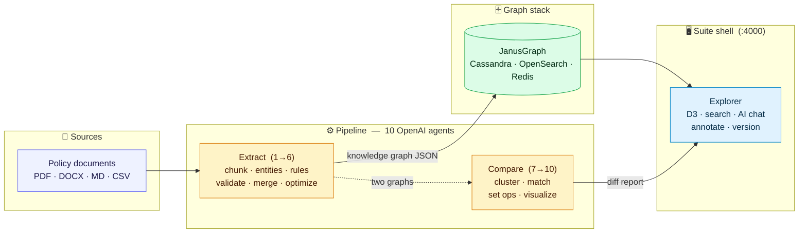

<div align="center">


# Policy to Knowledge

**Turn compliance policy documents into queryable, traceable knowledge graphs — then explore, edit, and version them in the browser.**

[](https://github.com/rrahimi-uci/policy-to-knowledge/actions/workflows/ci.yml)
[](LICENSE)


<br/>

[**📖 Documentation**](https://rrahimi-uci.github.io/policy-to-knowledge/) &nbsp;·&nbsp;
[**🏛️ Architecture**](https://rrahimi-uci.github.io/policy-to-knowledge/architecture.html) &nbsp;·&nbsp;
[**🗂️ Repository layout**](docs/STRUCTURE.md)

</div>

---

## 🎬 Demo

A narrated walkthrough of the full suite — the extraction pipeline, graph compare, and the interactive Explorer (15 scenes, ~7 min).

<div align="center">

<video src="https://github.com/rrahimi-uci/policy-to-knowledge/releases/download/v0.1.0-demo/policy-to-knowledge.mp4" controls width="100%">
  Your browser can't play the embedded video — <a href="https://github.com/rrahimi-uci/policy-to-knowledge/releases/download/v0.1.0-demo/policy-to-knowledge.mp4">watch or download the MP4</a>.
</video>

</div>

> Not seeing a player? [**Watch / download the MP4**](https://github.com/rrahimi-uci/policy-to-knowledge/releases/download/v0.1.0-demo/policy-to-knowledge.mp4). The video is generated from the deck in [`tools/video/`](tools/video).

---

## 💡 What it does

Compliance teams drown in dense, ever-changing policy documents. **Policy to Knowledge** runs those documents through a **10-agent OpenAI pipeline** that extracts business rules and entities, deduplicates and links them, and emits an optimized **knowledge graph** — with every rule traceable back to the source passage it came from. A graph **Explorer** then lets you query, visualize, annotate, compare, and version the result.

<table>
<tr>
<td width="50%" valign="top">

### 🧩 Extract
Segment documents, discover entities & relationships, mine business rules, validate, merge, optimize, and visualize.

</td>
<td width="50%" valign="top">

### 🔀 Compare
Run set operations (∩, differences, ∪, contradictions) across two graphs to see exactly what changed between versions or sources.

</td>
</tr>
<tr>
<td width="50%" valign="top">

### 🕸️ Explore
An interactive D3 graph over JanusGraph with search, an AI chat assistant, annotations, and release/versioning.

</td>
<td width="50%" valign="top">

### 🔎 Trace
Every rule node keeps a `source_reference` (chunk path) back to the originating document passage.

</td>
</tr>
</table>

---

## 🗺️ How it works

From raw policy documents to a versioned, queryable graph — every rule stays linked to the passage it came from.



### The 10-agent pipeline

```mermaid
flowchart LR
    START([📄 Document]) --> A1

    subgraph EXTRACT["Extraction &nbsp;· &nbsp;cli/extract.py"]
        direction LR
        A1["🔧 1<br/>Organizer"] --> A2["🏷️ 2<br/>Entities"]
        A2 --> A3["📜 3<br/>Rules"]
        A3 --> A35["✅ 3.5<br/>Validator"]
        A35 --> A4["🔗 4<br/>Merger"]
        A4 --> A5["⚡ 5<br/>Optimizer"]
        A5 --> A6["📊 6<br/>Visualize"]
    end

    A6 --> KG[("🕸️ Knowledge<br/>graph")]

    subgraph COMPARE["Comparison &nbsp;· &nbsp;cli/compare.py"]
        direction LR
        A7["📊 7<br/>Clusterer"] --> A8["🔍 8<br/>Matcher"]
        A8 --> A9["➗ 9<br/>Set ops"]
        A9 --> A10["🎨 10<br/>Visualize"]
    end

    KG -.->|graph A + B| A7
    A10 --> DIFF["∩ · − · ∪<br/>contradictions"]

    classDef ext fill:#fef3c7,stroke:#d97706,color:#451a03;
    classDef cmp fill:#e0f2fe,stroke:#0284c7,color:#082f49;
    classDef data fill:#dcfce7,stroke:#16a34a,color:#052e16;
    class A1,A2,A3,A35,A4,A5,A6 ext;
    class A7,A8,A9,A10 cmp;
    class KG,DIFF data;
```

<div align="center">



</div>

| # | Agent | Pipeline | Role |
|:---:|---|---|---|
| 1 | 🔧 Document Organizer | Extraction | Chunk and structure source documents |
| 2 | 🏷️ Entity Extractor | Extraction | Discover entities and relationships |
| 3 | 📜 Rules Extractor | Extraction | Extract business rules with a taxonomy |
| 3.5 | ✅ Validator | Extraction | Verify rules against source text |
| 4 | 🔗 Merger | Extraction | Merge rules and entities into a graph |
| 5 | ⚡ Optimizer | Extraction | Deduplicate and map dependencies |
| 6 | 📊 Visualization | Extraction | Render HTML report and graph |
| 7 | 📊 Clusterer | Comparison | Cluster rules across two graphs |
| 8 | 🔍 Semantic Matcher | Comparison | Match semantically equivalent rules |
| 9 | ➗ Set Operations | Comparison | Compute intersection / difference / union |
| 10 | 🎨 Set Visualization | Comparison | Render comparison HTML outputs |

> Full technical breakdown in [**apps/pipeline/docs/ARCHITECTURE.md**](apps/pipeline/docs/ARCHITECTURE.md).

---

## 🧱 Components

| Path | Purpose | Default URL |
| --- | --- | --- |
| [`apps/shell/`](apps/shell) | React + Vite **suite shell** that embeds the app UIs | `http://localhost:4000` |
| [`apps/pipeline/`](apps/pipeline) | 10-agent extraction + compare pipeline, FastAPI API, React UI | API `:8000` · UI `:5173` |
| [`apps/explorer/`](apps/explorer) | Graph **Explorer** (Flask + JanusGraph/Cassandra/OpenSearch/Redis) | `http://localhost:5000/app`¹ |
| [`tools/video/`](tools/video) | Demo-video generator (deck + AI narration → mp4) | n/a |

¹ On macOS port `5000` is often taken by Docker/AirPlay; the launcher then serves the Explorer on `5050` (set `SERVER_PORT`).

<details>
<summary><b>📁 Project structure</b></summary>

```text
.
├── apps/
│   ├── shell/        # Suite shell — React + Vite (:4000)
│   ├── pipeline/     # 10-agent pipeline + FastAPI API + React UI
│   │   └── cli/      #   extract.py (agents 1–6) · compare.py (agents 7–10)
│   └── explorer/     # Graph explorer — Flask + JanusGraph + D3 UI
├── tools/video/      # Demo capture & AI narration tooling
├── docs/             # GitHub Pages site (served from /docs)
├── assets/           # Shared brand assets
├── docker-compose.yml  # Full local stack
├── start.sh / stop.sh  # One-command orchestration
└── .github/workflows/  # CI (pytest ×2 + vitest ×2 + Allure)
```

See **[docs/STRUCTURE.md](docs/STRUCTURE.md)** for the full layout and the test-directory conventions (`tests/`, `tests/integration/`, `tests/e2e/`).

</details>

---

## 🚀 Quick start

> **Prerequisites:** Python 3.10+, Node 20, and Docker (for the Explorer's graph stack).

**1. Configure** — copy the gitignored templates and add your OpenAI key:

```bash
cp .env.example .env                                      # add OPENAI_API_KEY
cp apps/pipeline/config.example.json apps/pipeline/config.json
```

**2. Create a Python environment.** A single repo-root `.venv` works for both Python apps — `start.sh` uses it automatically when per-app venvs are absent:

```bash
python3 -m venv .venv
.venv/bin/pip install -r apps/pipeline/requirements-dev.txt
.venv/bin/pip install -r apps/explorer/requirements.txt
```

**3. Add your data** (none ships with this repo — the manifest only lists example graph names):

| Data | Destination |
| --- | --- |
| Source documents | `apps/pipeline/compliance-files/` |
| Knowledge-graph JSON | `apps/explorer/kgs/` |
| Source document chunks | `apps/explorer/kbs/` |

Make sure `apps/explorer/conf/graphs.yaml` matches those files.

**4. Launch the full stack** and open the shell:

```bash
./start.sh           # Explorer DB stack + Pipeline API/UI + suite shell
open http://localhost:4000
```

Stop everything (and tear down Docker infra) with `./stop.sh --all`.

---

## 🛠️ Common workflows

| Goal | Command |
| --- | --- |
| Full suite | `./start.sh` |
| Pipeline only | `cd apps/pipeline && ./start.sh` |
| Explorer only | `cd apps/explorer && ./start.sh` |
| Extract one document | `cd apps/pipeline && .venv/bin/python cli/extract.py --file compliance-files/<batch>/<file>.pdf --provider openai` |
| Batch extraction | `cd apps/pipeline && .venv/bin/python cli/extract.py --batch --provider openai` |
| Compare two graphs | `cd apps/pipeline && .venv/bin/python cli/compare.py --g1 graphA --g2 graphB --workers 15` |
| Incremental graph load | `cd apps/explorer && .venv/bin/python -m src.main setup-if-empty` |

Pipeline parameters (LLM models, reasoning effort, chunk sizes, worker counts, temperatures) are editable from the **Settings** page in the UI and persisted to `apps/pipeline/config.json`.

---

## 🔑 Key files

| File | Role |
| --- | --- |
| `apps/pipeline/config.json` | Pipeline models & runtime settings (gitignored; copy from `config.example.json`) |
| `apps/pipeline/domain-prompts/` | Per-domain prompt overrides (mortgage, aml, healthcare, commercial_lending) |
| `apps/explorer/conf/graphs.yaml` | Graph manifest & traversal-source names |
| `.env` | Shared local environment (incl. `OPENAI_API_KEY`); gitignored |
| `pipeline-output/`, `kgs/`, `kbs/` | Generated / user-supplied data; gitignored |

---

## 📚 Documentation

| Doc | Covers |
| --- | --- |
| [docs site](https://rrahimi-uci.github.io/policy-to-knowledge/) | Visual overview, architecture, walkthrough |
| [apps/shell/README.md](apps/shell/README.md) | Suite shell, micro-frontend embedding, routes |
| [apps/pipeline/README.md](apps/pipeline/README.md) | Extraction & compare pipeline, API/UI |
| [apps/explorer/README.md](apps/explorer/README.md) | Explorer runtime, manifest, graph loading |
| [apps/pipeline/docs/ARCHITECTURE.md](apps/pipeline/docs/ARCHITECTURE.md) | Pipeline architecture |
| [apps/pipeline/docs/DOCKER.md](apps/pipeline/docs/DOCKER.md) | Containerized workflows |
| [.github/CONTRIBUTING.md](.github/CONTRIBUTING.md) | Local setup & test expectations |

---

## 🧪 Testing

Every suite emits [Allure](https://allurereport.org/) results and code coverage; CI runs all four on each push.

```bash
# Backend (pytest → coverage + allure-results/)
(cd apps/pipeline && .venv/bin/python -m pytest)
(cd apps/explorer && .venv/bin/python -m pytest)

# Frontend (vitest → coverage + allure-results/)
(cd apps/shell                && npm test -- --coverage)
(cd apps/pipeline/ui/frontend && npm test -- --coverage)
```

Combine all suites into one Allure report (requires the [Allure CLI](https://allurereport.org/docs/install/)):

```bash
mkdir -p /tmp/allure
cp apps/*/allure-results/* apps/pipeline/ui/frontend/allure-results/* /tmp/allure/ 2>/dev/null
allure serve /tmp/allure
```

Unit tests (`tests/`, co-located `*.test.tsx`) run in CI and cover the logic layer. Live-backend integration (`apps/explorer/tests/integration/`) and Playwright UI suites (`tests/e2e/`) require the corresponding services running — see the component READMEs.

---

## 📄 License

Released under the [**MIT License**](LICENSE).

<div align="center">
<sub>Built with OpenAI · JanusGraph · FastAPI · React · D3</sub>
</div>
