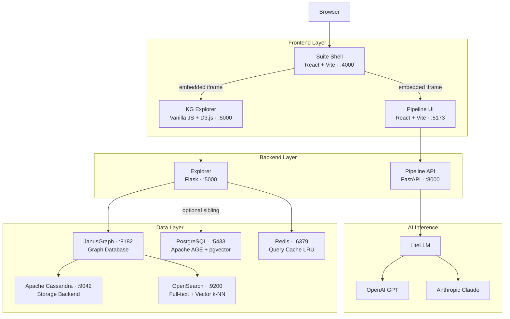
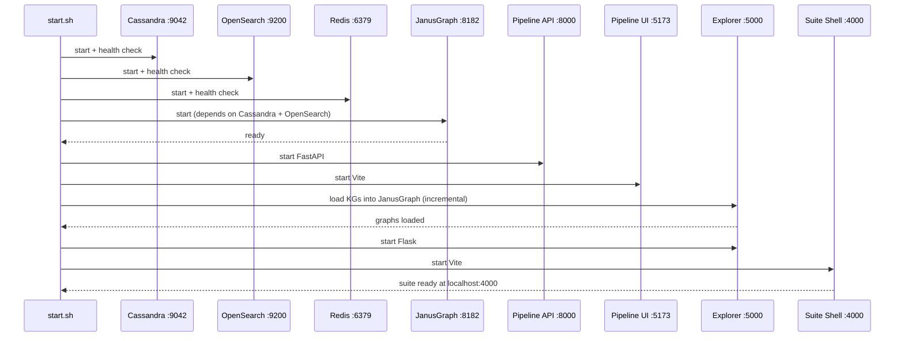

# Policy to Knowledge

[](https://github.com/your-org/policy-to-knowledge/actions/workflows/ci.yml)
[](LICENSE)
[](https://www.python.org/)
[](https://react.dev/)

An enterprise compliance automation platform that transforms compliance documents into structured, queryable knowledge graphs using a multi-agent AI pipeline. The suite integrates document extraction, graph storage, semantic search, and an interactive chat-based explorer into a single unified interface.

> 📖 **Documentation site:** a browsable overview lives in [`docs/`](docs/) and is published via GitHub Pages once enabled (Settings → Pages → `main` / `docs`).

---

## Overview

Policy to Knowledge is composed of three tightly integrated applications plus an
optional PostgreSQL-backed Assistant sibling:

| Application | Description | Port |
|---|---|---|
| **Policy to Knowledge Shell** | Central navigation hub — orchestrates all services | `4000` |
| **Pipeline** | 10-agent AI pipeline for document-to-KG extraction | `8000` (API), `5173` (UI) |
| **Explorer** | Interactive knowledge graph explorer with AI chat; default JanusGraph/Cassandra/OpenSearch backend | `5000` |
| **Assistant (Postgres)** | Drop-in sibling of Explorer using PostgreSQL + Apache AGE + pgvector | `5002` |

### Architecture



---

## Prerequisites

- [Docker](https://docs.docker.com/get-docker/) and Docker Compose
- Python 3.11 or 3.12 (for running agents outside Docker)
- Node.js 20+ (for frontend development outside Docker)
- An OpenAI API key (required); Anthropic API key (optional)

---

## Quick Start

```bash
# 1. Clone the repository
git clone <repo-url>
cd policy-to-knowledge

# 2. Configure environment
cp .env.example .env
# Open .env and set OPENAI_API_KEY at minimum

# 3. Start the full stack (~2–3 minutes on first run)
./start.sh

# 4. Open the suite
open http://localhost:4000
```

To stop all services:

```bash
./stop.sh --all
```

### What `start.sh` does

1. Validates Docker, Python venv, and port availability
2. Generates JanusGraph configuration from `assistant/conf/graphs.yaml`
3. Starts infrastructure services in dependency order (Cassandra → OpenSearch → Redis → JanusGraph)
4. Waits for each service to pass its health check
5. Starts the Pipeline API (FastAPI, port 8000) and Pipeline UI (Vite, port 5173)
6. Loads knowledge graphs into JanusGraph (incremental by default)
7. Starts Explorer (Flask, port 5000)
8. Starts the Suite Shell (Vite, port 4000)



---

## Services and Ports

| Service | URL | Description |
|---|---|---|
| Suite Shell | http://localhost:4000 | Main navigation hub |
| Pipeline UI | http://localhost:5173 | Document upload and pipeline control |
| Pipeline API | http://localhost:8000 | FastAPI backend for extraction |
| Explorer | http://localhost:5000/app | KG explorer and AI chat |
| Assistant (Postgres) | http://localhost:5002/p2k-postgres | KG explorer backed by PostgreSQL + Apache AGE + pgvector |
| JanusGraph | localhost:8182 | Gremlin WebSocket endpoint |
| OpenSearch | http://localhost:9200 | Full-text and vector search |
| Cassandra | localhost:9042 | Graph storage backend |
| Redis | localhost:6379 | Query result cache |

### Assistant Backend

`assistant` provides the JanusGraph-backed graph store, serving the
REST/UI contract consumed by the shared frontend.

```bash
cd assistant
./start.sh
```

---

## Configuration

### Environment Variables

Copy `.env.example` to `.env` and configure:

```bash
# Required
OPENAI_API_KEY=sk-...

# Optional
ANTHROPIC_API_KEY=sk-ant-...
OPENAI_CHAT_MODEL=gpt-4o-mini       # Default chat model (was gpt-4o; mini is ~3-5x faster)
OPENAI_REASONING_EFFORT=low         # Reasoning effort for reasoning-capable models
MAX_TOOL_ROUNDS=3                   # Max sequential tool-call rounds per chat turn

# Port overrides (all optional)
SUITE_PORT=4000
KG_BACKEND_PORT=8000
KG_FRONTEND_PORT=5173
CA_PORT=5000
JANUSGRAPH_PORT=8182
CASSANDRA_PORT=9042
OPENSEARCH_PORT=9200
REDIS_PORT=6379

# Internal hostnames used when the JanusGraph container opens new graphs at
# runtime (Groovy scripts execute server-side, so they must use the docker
# network hostnames "cassandra"/"opensearch" — not "localhost"). These are
# auto-derived from the values above and only need to be overridden when
# running JanusGraph outside the bundled docker-compose network.
CASSANDRA_HOST_INTERNAL=cassandra
OPENSEARCH_HOST_INTERNAL=opensearch
```

### Pipeline Configuration

Edit `pipeline/config.json` to control:

- LLM models and batch sizes per agent
- Target rule counts per knowledge graph
- Supported dependency types
- Output directory structure

### Knowledge Graph Manifest

`assistant/conf/graphs.yaml` is the single source of truth for all loaded knowledge graphs. Add or remove graphs here; the startup script regenerates JanusGraph configuration from this file automatically.

---

## Running the Extraction Pipeline

### Via the UI

Open the Pipeline UI at http://localhost:5173, upload compliance documents, and trigger extraction from the dashboard.

### Via the CLI

```bash
cd pipeline

# Extract from all documents using OpenAI
python3 knowledge_graph_generation.py --provider openai

# Extract a single document
python3 knowledge_graph_generation.py --provider openai --file compliance-files/example.pdf

# Run only a specific extraction step (1: organize, 2: entities, 3: rules,
# 4: merge, 5: optimize, 6: visualize)
python3 knowledge_graph_generation.py --step 1

# Run the merge phase (Agents 7–9) after per-document extraction
python3 knowledge_graph_generation.py --merge

# Only run the merge phase against existing per-document KGs
python3 knowledge_graph_generation.py --merge-only --merge-strategy provenance

# Process documents in batches by subdirectory
python3 knowledge_graph_generation.py --batch

# Restrict to a specific domain subdirectory
python3 knowledge_graph_generation.py --batch-dir healthcare
```

### Graph Merging

```bash
cd pipeline

# List available graphs
python3 join_graphs.py --list

# Merge two graphs
python3 join_graphs.py --g1 FMNA --g2 Revolution-Overlay --workers 15
```

### Supported Domains

Four first-class domains, surfaced everywhere (Documents tabs, graph-summary `domain` field, Compare Graphs dropdown grouping):

- Mortgage lending (default)
- Anti-money laundering (AML)
- Commercial lending
- Healthcare

Assign a folder to a domain via the Documents page, or edit `pipeline/compliance-files/.folder_domains.json` directly. Folders without an explicit assignment fall back to keyword inference (see `_DOMAIN_KEYWORDS` in [pipeline/ui/backend/services/graph_service.py](pipeline/ui/backend/services/graph_service.py)).

### Pipeline Agents

| Agents | Phase | Tasks |
|---|---|---|
| 1–6 | Extraction | Document organization → entity extraction → rule extraction (+ validator 3.5) → rules-with-entities merge → KG optimization → visualization & report |
| 7–10 | Merging | Rule-type clustering → semantic rule matching → set operations (union / intersection / provenance) → set visualization |

```mermaid
flowchart LR
    Docs["Compliance\nDocuments"]

    subgraph Extraction["Phase 1 — Extraction"]
        A1["Agent 1\nDocument\nOrganizer"]
        A2["Agent 2\nEntity\nExtractor"]
        A3["Agent 3\nRule\nExtractor"]
        A35["Agent 3.5\nValidator"]
        A4["Agent 4\nRule–Entity\nMerger"]
        A5["Agent 5\nKG\nOptimizer"]
        A6["Agent 6\nVisualizer\n& Reporter"]
    end

    subgraph Merging["Phase 2 — Merging"]
        A7["Agent 7\nRule-Type\nClusterer"]
        A8["Agent 8\nSemantic\nMatcher"]
        A9["Agent 9\nSet Operations\nUnion / Intersect"]
        A10["Agent 10\nSet\nVisualizer"]
    end

    PerDocKG["Per-doc\nKnowledge Graph"]
    MergedKG["Merged\nKnowledge Graph"]

    Docs --> A1 --> A2 --> A3 --> A35 --> A4 --> A5 --> A6 --> PerDocKG
    PerDocKG --> A7 --> A8 --> A9 --> A10 --> MergedKG
```



---

## Knowledge Graph Management

```bash
cd assistant

# Full rebuild (clears and reloads all graphs)
python3 -m src.main setup

# Incremental load (only load what is missing)
python3 -m src.main setup-if-empty

# Nuclear reset (wipe all data and rebuild)
python3 -m src.main force-clean

# Start Explorer only (infrastructure must already be running)
python3 -m src.main serve
```

### Admin API

Explorer exposes admin endpoints for repairing or rebuilding the loaded graphs without restarting the stack (full reference in [ENDPOINTS.md](ENDPOINTS.md)):

| Method | Endpoint | Purpose |
|---|---|---|
| POST | `/app/api/admin/reset` | Drop and re-load every graph from `kgs/*.json`, rebuild OpenSearch indices and embeddings |
| GET | `/app/api/admin/consistency` | Vertex/edge counts per graph (sanity check after a reset or republish) |
| POST | `/app/api/admin/rebuild-embeddings` | Re-embed all vertices into OpenSearch k-NN |
| POST | `/app/api/admin/rebuild-tasks` | Regenerate the task queue from current graph state |

### Pre-loaded Knowledge Graphs

The canonical list lives in [assistant/conf/graphs.yaml](assistant/conf/graphs.yaml) — `start.sh` regenerates JanusGraph configuration from this file on every launch.

| Graph | Domain |
|---|---|
| Policy to Knowledge Guidelines | Internal compliance policy (mortgage) |
| Fannie Mae | Mortgage lending standards |
| Freddie Mac | Mortgage lending standards |
| PRMI | Mortgage lending standards |
| Revolution | Mortgage compliance overlays |
| Absa | Anti-money laundering |
| Barclays | Anti-money laundering |
| Comercial Lending | Commercial lending |
| Healthcare | Healthcare |

Graph JSON files live in `assistant/kgs/`. Source documents are in `assistant/kbs/` and `pipeline/compliance-files/`. Each folder is associated with one of the four supported domains (mortgage, aml, commercial_lending, healthcare) via `pipeline/compliance-files/.folder_domains.json`; the same taxonomy drives the **Compare Knowledge Graphs** dropdown so every domain appears in a fixed order even when it has no graphs yet.

---

## Technology Stack

| Layer | Technology |
|---|---|
| **Frontend (Suite Shell)** | React 19, TypeScript, Tailwind CSS, Vite |
| **Frontend (Pipeline UI)** | React 19, TypeScript, Tailwind CSS, Vite |
| **Frontend (KG Explorer)** | Vanilla JavaScript, D3.js v7, marked.js |
| **Backend (Pipeline)** | FastAPI, Uvicorn, SQLite, SQLAlchemy |
| **Backend (Copilot)** | Flask 3.1, Gremlin WebSocket, OpenSearch HTTP |
| **AI Inference** | LiteLLM (OpenAI GPT, Anthropic Claude) |
| **Graph Database** | JanusGraph 1.0 |
| **Storage Backend** | Apache Cassandra 4.1 |
| **Search & Vectors** | OpenSearch 2.17 (full-text + k-NN, 384-dim) |
| **Embeddings** | sentence-transformers (all-MiniLM-L6-v2) |
| **Cache** | Redis 7 (LRU) |
| **Document Parsing** | PyPDF2, python-docx, pandas, openpyxl, pytesseract (OCR) |
| **Containerization** | Docker, Docker Compose |
| **Cloud Deployment** | Azure Container Apps, Bicep IaC |
| **Testing** | Playwright (E2E), pytest (backend) |

---

## Development

### Running Individual Services

```bash
# Explorer (Flask)
cd assistant
python3 -m src.server

# Suite Shell (React)
cd frontend
npm install && npm run dev

# Pipeline UI + API
cd pipeline
./ui/start.sh
```

### Running Tests

```bash
# Backend tests
cd pipeline
pytest tests/

# E2E tests (requires all services running)
cd frontend
npx playwright test
```

---

## Azure Deployment

Policy to Knowledge runs on Azure Container Apps (ACA). Build and push all 5 Policy to Knowledge
Suite images to a single ACR (e.g. `p2kdemo`) using a unique UTC
timestamp tag per build, then roll each Container App to the freshly tagged
image. The conceptual layout below describes how the apps are wired together.

### Container App layout (ACA)

| App | Ingress | Internal port | Public mount |
|---|---|---|---|
| `p2k-preview` (suite-shell) | external | 4000 | `/app/` |
| `kg-frontend` | external | 5173 | `/app/{documents,pipeline,explorer,compare,runs,settings}` |
| `kg-backend` | internal | 8000 | proxied as `/app/api/kg/`, `/app/api/`, `/app/ws/` |
| `assistant` | external | 5000 | `/app/api/ca/`, also direct `/app/...` |
| `janusgraph` | internal | 8182 | (not exposed publicly) |

Inter-app HTTP inside an ACA env always goes through the L7 router on **port 80** with `Host` header set to the upstream app name — never the targetPort. The bundled [frontend/nginx.conf](frontend/nginx.conf) already follows this convention.

### Persistence note

`kg-backend` ships with a populated SQLite run history at `/app/ui/backend/runs.db`. Do **not** set `PIPELINE_DATA_DIR` on the ACA app unless you also mount an Azure Files share at that path — otherwise the app silently writes to an empty ephemeral directory and `/app/api/runs` returns `{"runs":[]}` after every restart. The same applies to any directory the assistant or pipeline writes to (`pipeline-output/`, `kbs/`, `kgs/`, `conf/`): without a volume mount, new uploads are lost on revision change.

---

## Putting it Behind an External nginx

In production you typically run Policy to Knowledge behind a customer-managed reverse proxy (nginx, Traefik, Cloudflare, an Azure Front Door, etc.) that terminates TLS and forwards a single hostname to the suite. The suite is designed to live under the path prefix `/app/` so it can be mounted alongside other apps on the same domain.

### What you need to forward

The external proxy only needs to forward **one** location to the suite-shell — everything else (KG frontend assets, both backends, WebSockets) is already wired up by the suite-shell's own internal nginx.

| Browser path | Forward to | Notes |
|---|---|---|
| `/app/` (and everything under it) | `p2k-preview` (port 4000 / ACA FQDN) | One upstream is enough |
| `/app/ws/` | same upstream | Must enable WebSocket upgrade |

The suite-shell nginx then dispatches internally to `kg-backend`, `kg-frontend`, and `assistant` — see [Nginx Locations](ENDPOINTS.md#nginx-locations) in the endpoint reference for the full table.

### Sample nginx config (in front of ACA)

```nginx
# /etc/nginx/sites-enabled/app.example.com
upstream policy_to_knowledge {
    # Public ACA FQDN of the suite-shell app.
    server p2k-preview.<env-id>.<region>.azurecontainerapps.io:443;
}

server {
    listen 443 ssl http2;
    server_name app.example.com;

    ssl_certificate     /etc/letsencrypt/live/app.example.com/fullchain.pem;
    ssl_certificate_key /etc/letsencrypt/live/app.example.com/privkey.pem;

    client_max_body_size 500M;          # uploads can be large
    proxy_read_timeout   300s;          # extraction can take minutes

    # WebSockets (pipeline + impact analysis live updates)
    location /app/ws/ {
        proxy_pass         https://policy_to_knowledge;
        proxy_http_version 1.1;
        proxy_set_header   Upgrade $http_upgrade;
        proxy_set_header   Connection "upgrade";
        proxy_set_header   Host p2k-preview.<env-id>.<region>.azurecontainerapps.io;
        proxy_set_header   X-Forwarded-For   $proxy_add_x_forwarded_for;
        proxy_set_header   X-Forwarded-Proto $scheme;
        proxy_read_timeout 86400;
    }

    # Everything else under /app/
    location /app/ {
        proxy_pass         https://policy_to_knowledge;
        proxy_set_header   Host p2k-preview.<env-id>.<region>.azurecontainerapps.io;
        proxy_set_header   X-Real-IP         $remote_addr;
        proxy_set_header   X-Forwarded-For   $proxy_add_x_forwarded_for;
        proxy_set_header   X-Forwarded-Proto $scheme;
    }

    # Optional: redirect bare domain to the suite
    location = / {
        return 301 /app/;
    }
}

server {
    listen 80;
    server_name app.example.com;
    return 301 https://$host$request_uri;
}
```

### Sample nginx config (in front of docker-compose)

If the suite is running on a host via `./start.sh` rather than ACA, point the upstream at the local suite-shell port:

```nginx
upstream policy_to_knowledge { server 127.0.0.1:4000; }

server {
    listen 443 ssl http2;
    server_name app.example.com;
    # ssl_certificate / ssl_certificate_key as above

    client_max_body_size 500M;
    proxy_read_timeout   300s;

    location /app/ws/ {
        proxy_pass         http://policy_to_knowledge;
        proxy_http_version 1.1;
        proxy_set_header   Upgrade $http_upgrade;
        proxy_set_header   Connection "upgrade";
        proxy_set_header   Host $host;
        proxy_set_header   X-Forwarded-For   $proxy_add_x_forwarded_for;
        proxy_set_header   X-Forwarded-Proto $scheme;
        proxy_read_timeout 86400;
    }

    location /app/ {
        proxy_pass         http://policy_to_knowledge;
        proxy_set_header   Host $host;
        proxy_set_header   X-Real-IP         $remote_addr;
        proxy_set_header   X-Forwarded-For   $proxy_add_x_forwarded_for;
        proxy_set_header   X-Forwarded-Proto $scheme;
    }
}
```

### Gotchas

- **TLS termination**: the suite-shell already sets `absolute_redirect off; port_in_redirect off;` so 301s preserve the public scheme/host. Make sure your proxy passes `X-Forwarded-Proto` so backends generate `https://` links.
- **`Host` header to ACA**: when forwarding to a Container Apps ingress you must set `Host` to the **app FQDN**, not the public hostname — ACA routes by Host header. If you forward your own hostname unchanged ACA returns 404.
- **WebSockets**: required for the live pipeline log stream. Without an `Upgrade` block the Pipeline tab will show "connecting…" forever.
- **Body size**: document uploads can be large. Set `client_max_body_size` to at least 500 MB on every proxy in the chain.
- **Sticky sessions**: the suite is stateless across replicas — no sticky-session config needed.
- **Mounting under a different prefix**: the prefix `/app/` is baked into the SPA bundles at build time via `BASE_PATH`. If you need a different prefix, rebuild the suite-shell and kg-frontend images with `--build-arg BASE_PATH=/yourprefix` (and the matching `VITE_BASE_PATH` / `VITE_CA_URL`).

### Verifying the proxy

```bash
# Should return 200 + HTML
curl -sI https://app.example.com/app/ | head -5

# Should return JSON, not HTML (if it returns HTML the /api/ proxy is missing)
curl -sS https://app.example.com/app/api/graphs | head -c 200

# Should return JSON with run history (if empty after restart, see Persistence note above)
curl -sS https://app.example.com/app/api/runs | head -c 200
```

---

## Project Structure

```
policy-to-knowledge/
├── pipeline/          # 10-agent extraction pipeline + FastAPI UI backend
│   ├── agents/               # Agent implementations
│   ├── prompts/              # LLM prompt templates
│   ├── ui/                   # FastAPI backend + React frontend
│   ├── compliance-files/     # Input documents (organized by domain)
│   ├── pipeline-output/      # Generated knowledge graphs and reports
│   ├── domain-prompts/       # Domain-specific prompt overrides
│   └── utils/                # LLM client, config, prompt manager
│
├── assistant/         # Explorer — KG explorer and AI chat
│   ├── src/                  # Flask API and service layer
│   ├── ui/                   # Vanilla JS SPA (D3.js visualization)
│   ├── kgs/                  # Pre-built knowledge graph JSON files
│   ├── kbs/                  # Source documents by domain
│   └── conf/                 # JanusGraph configuration (generated from graphs.yaml)
│
├── frontend/                 # Policy to Knowledge Shell (React navigation hub)
│   └── src/
│       ├── pages/            # Home, Extraction, Assistant, Analytics, etc.
│       ├── components/       # Reusable UI components
│       └── bridge/           # Cross-service communication
│
├── docker-compose.yml        # Full-stack service orchestration (8 services)
├── start.sh                  # One-command full-stack launcher
├── stop.sh                   # Graceful shutdown
└── .env.example              # Environment variable template
```

---

## Troubleshooting

**Services fail to start — JanusGraph not ready**
JanusGraph requires Cassandra and OpenSearch to be fully healthy first. The startup script waits automatically, but on slow machines the timeout may need to be increased. Check `docker compose logs janusgraph` for details.

**Graph load takes too long on first run**
The first `setup` run builds OpenSearch indices and loads all graph data. Subsequent runs use `setup-if-empty` (incremental) and are much faster.

**Pipeline returns empty results**
Verify `OPENAI_API_KEY` is set in `.env` and that the documents in `compliance-files/` are readable (PDF/DOCX/MD/CSV/XLSX). Check `pipeline/pipeline-output/` for partial outputs and agent logs.

**Port conflicts**
Override any port in `.env` using the `*_PORT` variables listed in the Configuration section.

---

## Testing

Each app has its own offline test suite (run in [CI](.github/workflows/ci.yml)):

```bash
cd pipeline && python -m pytest                  # pipeline (Python)
cd assistant && python -m pytest tests/          # explorer offline unit tests
cd frontend && npm test                          # suite shell (Vitest)
cd pipeline/ui/frontend && npm test              # pipeline UI (Vitest)
```

Playwright and live-backend end-to-end suites require the services running and
are not part of CI.

---

## Data & secrets

No proprietary data or secrets are distributed with this repository. The
`assistant/kbs/`, `assistant/kgs/`, `pipeline/compliance-files/`, and
`pipeline/pipeline-output/` directories are gitignored placeholders — supply
your own data locally (see the README in each). `.env` and `config.json` are
gitignored; configure all keys via environment variables.

---

## Contributing

Contributions are welcome — see [CONTRIBUTING.md](CONTRIBUTING.md) for setup,
testing, and PR guidelines, and [SECURITY.md](SECURITY.md) to report
vulnerabilities privately.

## License

Released under the [MIT License](LICENSE).
