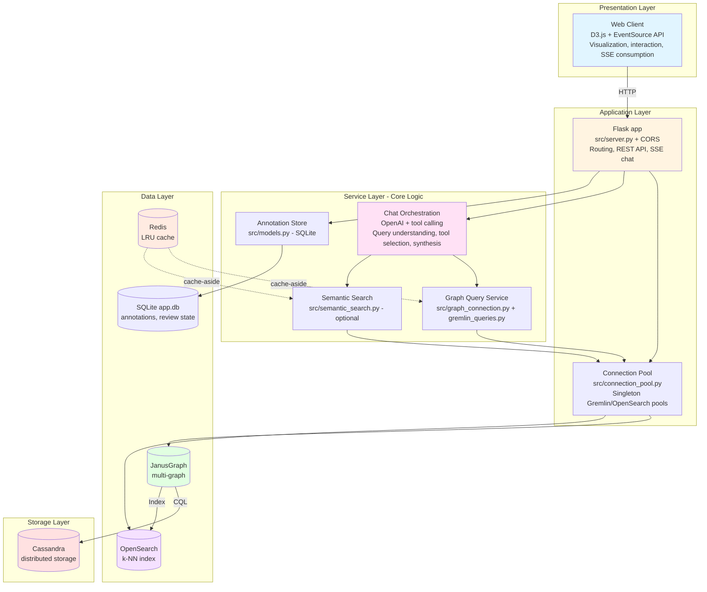
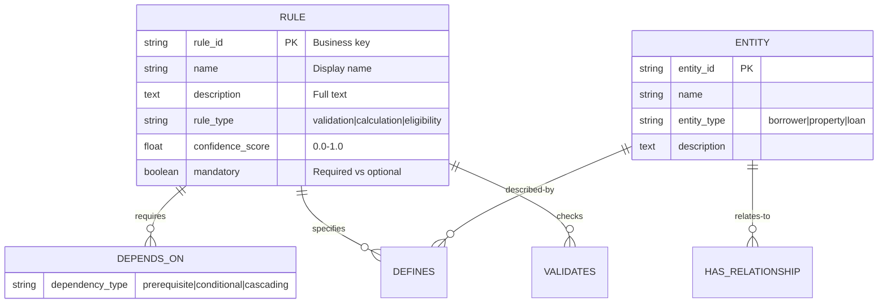
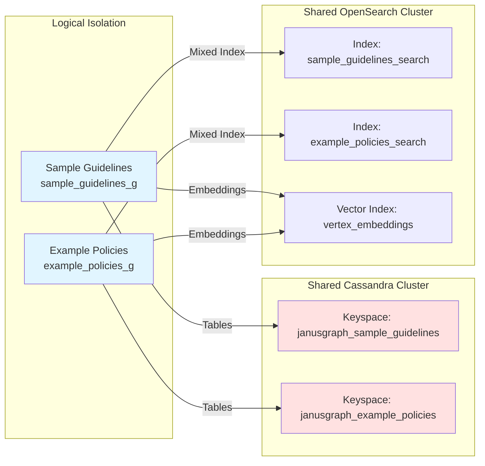
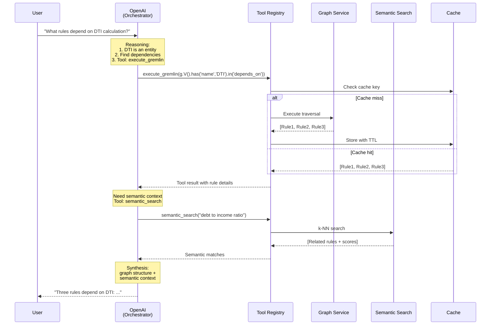
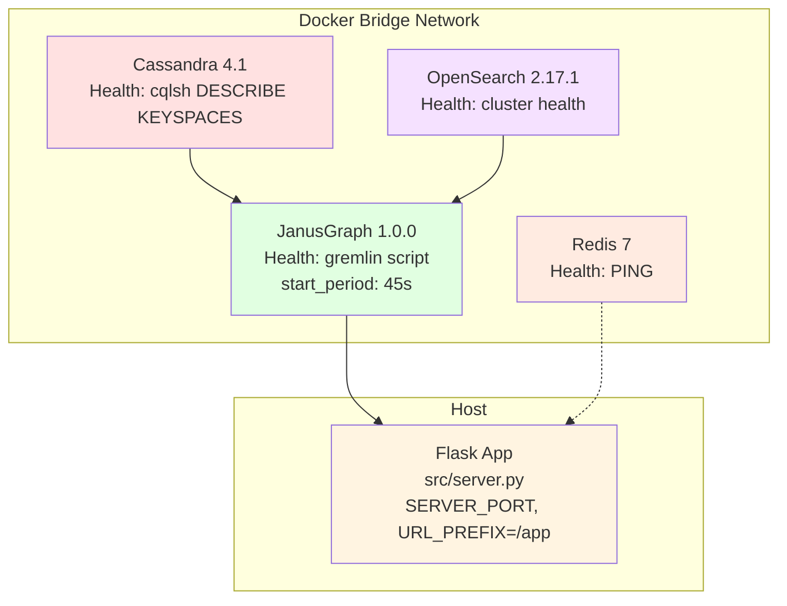

# Explorer — System Architecture

## Executive summary

Explorer is the graph-serving application of the Policy to Knowledge monorepo. It
enables intelligent exploration of regulatory compliance knowledge through a
conversational assistant, semantic search, and interactive visualization. The design
addresses a domain where the *relationships* between rules matter as much as the rules
themselves.

**Core approach:** graph-native data modeling with AI-augmented querying and
presentation layers.

**Backend note:** this document describes the JanusGraph / Cassandra / OpenSearch
architecture that lives in `apps/explorer`. The data stack runs via `docker compose`;
the Flask server (`src/server.py`) runs on the host under the `/app` URL prefix and
serves the UI in `ui/`.

## Table of contents

- [Architectural overview](#architectural-overview)
- [System architecture](#system-architecture)
- [Data architecture](#data-architecture)
- [Integration architecture](#integration-architecture)
- [Deployment architecture](#deployment-architecture)
- [Trade-offs & constraints](#trade-offs--constraints)

---

## Architectural overview

### Business problem

Compliance work requires navigating complex, interconnected rule sets where:

- Rules reference and depend on other rules (transitive dependencies)
- Relationships between rules are first-class domain concepts
- Natural-language queries must resolve to precise compliance requirements
- Semantic similarity matters as much as exact text matching
- Rule interpretation requires understanding multi-hop relationships

### Architectural solution

A polyglot-persistence architecture combining:

1. **Property graph database** (JanusGraph) for relationship-first modeling
2. **Vector search engine** (OpenSearch k-NN) for semantic similarity — optional
3. **LLM orchestration layer** (OpenAI, default `gpt-4o-mini`) for natural-language
   understanding and tool calling
4. **Distributed caching** (Redis) for query-result optimization
5. **Event-driven streaming** (Server-Sent Events) for real-time chat feedback

---

## System architecture

### Logical architecture — layered + service-oriented



**Key characteristics:**

1. **Externalized state** — graph, search, and annotation state live in the data
   stores; the Flask process holds little durable state.
2. **Polyglot persistence** — specialized stores per workload (graph, search, cache,
   relational annotations).
3. **Connection pooling** — singleton Gremlin and OpenSearch pools
   (`src/connection_pool.py`) avoid per-request connection churn.
4. **Cache-aside pattern** — the application manages Redis; the data layer is unaware
   of caching (`src/cache.py`).
5. **Event-driven chat UI** — Server-Sent Events stream chat tokens and tool steps,
   avoiding polling.

### Source modules

| Module | Responsibility |
| --- | --- |
| `src/server.py` | Flask app, REST API, SSE chat, tool registry, prefix middleware |
| `src/graph_connection.py` | Gremlin connection helper / traversal context manager |
| `src/connection_pool.py` | Singleton Gremlin + OpenSearch connection pools |
| `src/data_loader.py` | Loads knowledge-graph JSON into JanusGraph |
| `src/schema.py` | Vertex/edge labels, property keys, mixed indexes |
| `src/semantic_search.py` | OpenSearch k-NN embedding index and search (optional) |
| `src/gremlin_queries.py` | Reusable example traversals |
| `src/gremlin_safety.py` | Read-only guard for the raw Gremlin endpoint |
| `src/cache.py` | Redis cache layer |
| `src/models.py` | SQLAlchemy annotation / review-state models (SQLite `app.db`) |
| `src/docs_sync.py` | Source-document folder resolution helpers |
| `src/main.py` | Setup / load / clean / serve CLI |

---

### Technology stack

| Category | Technology | Notes |
| --- | --- | --- |
| Graph database | JanusGraph 1.0.0 | TinkerPop compliance, polyglot backends, Apache license |
| Storage backend | Cassandra 4.1 | Linear scalability, tunable consistency |
| Search & vectors | OpenSearch 2.17.1 | k-NN plugin, full-text index |
| Application runtime | Python 3.10+ / Flask 3.1 | OpenAI SDK, rich ML ecosystem |
| LLM | OpenAI (default `gpt-4o-mini`) | Tool calling + streaming; model configurable |
| Embedding model | all-MiniLM-L6-v2 (384-dim) | Optional; requires `sentence-transformers` |
| Cache | Redis 7 | LRU eviction, sub-millisecond reads |
| Orchestration | Docker Compose v2 | Data stack only; Flask runs on the host |

---

## Data architecture

### Graph schema — domain model

The schema models compliance as a directed property graph optimized for relationship
traversal:



**Schema principles:**

1. **Edges as first-class entities** — dependency types are edge properties, enabling
   queries such as "find all prerequisite dependencies".
2. **Denormalization for read performance** — rule descriptions are stored on the
   vertex (duplication accepted for query speed).
3. **Weak schema** — no foreign-key constraints; graph relationships carry referential
   meaning.
4. **Stable business keys** — `rule_id` is separate from internal JanusGraph IDs.

**Index strategy:**

| Index type | Fields | Purpose | Backend |
| --- | --- | --- | --- |
| Mixed | name, description (text) | Full-text search | OpenSearch |
| Composite | rule_id (unique) | Fast PK lookup | Cassandra |
| k-NN vector | embedding (384-dim float[]) | Semantic similarity | OpenSearch |

The k-NN embedding index (`vertex_embeddings` by default) is maintained separately by
`src/semantic_search.py`, which keeps the embedding model independent of the graph
schema and lets the rest of the app run when embeddings are absent.

---

### Multi-graph isolation



**Graph manifest** (`conf/graphs.yaml`):

| Graph | Traversal source | Cassandra keyspace | OpenSearch index | KG file |
| --- | --- | --- | --- | --- |
| Sample Guidelines | `sample_guidelines_g` | `janusgraph_sample_guidelines` | `sample_guidelines_search` | `kgs/sample-guidelines-kg.json` |
| Example Policies | `example_policies_g` | `janusgraph_example_policies` | `example_policies_search` | `kgs/example-policies-kg.json` |

Add a graph by appending a block to `conf/graphs.yaml` and running
`python scripts/generate_graph_config.py`, which regenerates the JanusGraph properties
files, `gremlin-server.yaml`, and `init-graphs.groovy`.

**Isolation benefits:**

- **Failure isolation** — index corruption in one graph does not affect others
- **Performance isolation** — heavy queries are bounded to a single keyspace
- **Schema evolution** — independent schema versioning per graph
- **Config-driven extensibility** — new graphs need no code changes

---

## Integration architecture

### AI–graph integration pattern

**Challenge:** LLMs operate on text; graphs operate on structured relationships.
Bridging them requires:

1. Converting natural language into graph queries (intent → traversal)
2. Enriching graph results with semantic context
3. Synthesizing graph data into natural-language responses

**Solution:** tool-calling orchestration as an integration layer. The chat assistant
calls tools registered in `src/server.py` (graph traversal, semantic search, text
search, vertex details, and more), and the model synthesizes the results.



**Patterns employed:**

1. **Adapter** — tools adapt LLM function calls to backend APIs (Gremlin, OpenSearch).
2. **Cache-aside** — expensive backend calls are cached before re-execution.
3. **Graceful degradation** — when semantic search is unavailable, ranking falls back
   to structural and keyword signals; chat and graph traversal still work.

**Error handling:**

- Tool failures return structured error results rather than raising; the model can
  retry with a different tool.
- The raw Gremlin endpoint is restricted to read-only traversals via
  `src/gremlin_safety.py`.

---

### Event-driven streaming — Server-Sent Events

**Context:** LLM responses can take several seconds. Request/response alone produces a
poor chat experience.

**Decision:** Server-Sent Events (SSE) rather than WebSockets.

**Rationale:**

- **Unidirectional** — server → client streaming is sufficient for chat
- **HTTP-based** — works through proxies and load balancers
- **Automatic reconnection** — handled by the browser
- **Simpler** — no WebSocket handshake to manage

**SSE message protocol (illustrative):**

```text
event: step
data: {"label": "Analyzing query", "status": "active"}

event: search
data: {"tool": "semantic_search", "nodes": [...]}

event: token
data: {"content": "Based"}

event: done
data: {}
```

---

## Deployment architecture

### Containerized data stack — Docker Compose

`docker-compose.yml` defines the four data services. The Flask server runs on the host
(via `start.sh` or `python -m src.server`) and connects to the stack.



**Startup orchestration:**

1. Cassandra, OpenSearch, and Redis start in parallel.
2. JanusGraph waits for Cassandra and OpenSearch to report healthy
   (`depends_on: service_healthy`), with a 45-second start grace period.
3. The Flask server is started on the host once the stack is up; `start.sh` waits for
   the server's URL to respond before reporting ready.

**Volume strategy:**

```yaml
volumes:
  cassandra-data:   # Persistent: graph data
  opensearch-data:  # Persistent: indexes
  redis-data:       # Cache; can be rebuilt
```

**Memory caps (defaults, configurable via `.env`):**

```text
Cassandra:  MAX_HEAP_SIZE 512M
OpenSearch: -Xms256m -Xmx256m
Redis:      maxmemory 256mb (allkeys-lru)
JanusGraph: mem_limit 2g, JAVA_OPTIONS -Xms256m -Xmx1024m
```

The JanusGraph heap is explicitly capped because, without a cap, the JVM sizes its heap
to a fraction of total host RAM and can trigger an OOM kill on memory-constrained hosts.

---

## Trade-offs & constraints

### Key trade-offs

| Decision | Advantages | Disadvantages |
| --- | --- | --- |
| JanusGraph over Neo4j | Apache license; polyglot backends; TinkerPop standard | Smaller community; more operational complexity |
| Hosted OpenAI vs self-hosted LLM | Strong quality; no inference infra; native tool calling | API cost and dependency; data leaves the host |
| SSE vs WebSockets | Simpler, proxy-friendly, auto-reconnect | Unidirectional only |
| Cache-aside vs write-through | Simple logic; failure isolation; read-optimized | Possible stale reads; manual invalidation |
| Multi-graph vs single multi-tenant graph | Complete isolation; config-driven via `graphs.yaml` | Operational overhead; routing complexity |
| Optional semantic search | App still runs without `sentence-transformers`/embeddings | Reduced ranking quality when disabled |

### Tunable settings

Defaults live in `conf/config.py` and can be overridden via `.env` or the shell:

- `CACHE_TTL` — Redis TTL (default 3600s)
- `POOL_MIN_SIZE` / `POOL_MAX_SIZE` — connection pool bounds (2 / 10)
- `SEMANTIC_SEARCH_DEFAULT_TOP_K` — semantic results (default 5)
- `EMBEDDING_MODEL` / `EMBEDDING_DIM` — embedding model and dimension
  (`all-MiniLM-L6-v2`, 384)
- `OPENAI_CHAT_MODEL` / `MAX_TOOL_ROUNDS` — chat model and tool-round budget
- `SERVER_PORT` / `URL_PREFIX` — server bind port and mount prefix
