# Compliance Knowledge Graph Builder - Architecture

> **Technical Architecture v4.1** | February 2026

## System Overview

A multi-agent AI system that transforms unstructured compliance documents into structured knowledge graphs. The system is **domain-agnostic** and can be configured for any industry's regulatory requirements through pluggable domain configurations.

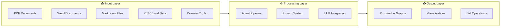

---

## 1. High-Level Architecture

### Layered Architecture

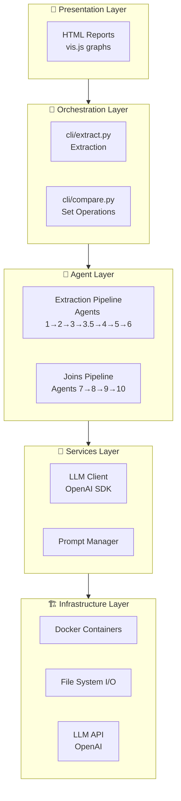

### Component Responsibilities

| Layer | Components | Responsibility |
|-------|------------|----------------|
| **Presentation** | HTML Reports | User-facing outputs and visualization |
| **Orchestration** | cli/extract.py, cli/compare.py | Pipeline execution coordination |
| **Agent** | 10 specialized agents | Domain-specific processing logic |
| **Services** | Utils modules | Shared infrastructure (LLM, prompts, config) |
| **Infrastructure** | Docker, File I/O | Deployment and data persistence |

---

## 2. Agent Pipeline Architecture

### Extraction Pipeline (Agents 1-6)

Sequential processing that transforms compliance documents into knowledge graphs:

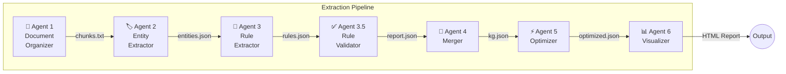

### Joins Pipeline (Agents 7-10)

Set operations for comparing and merging knowledge graphs:

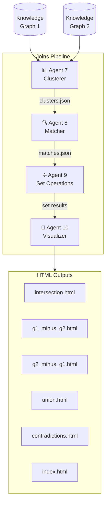

### Agent Interface Contract

All agents follow a standardized interface pattern:

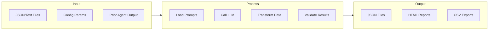

---

## 3. Document Processing Architecture

### Agent 1: Document Chunker Tools

Agent 1 uses a tool-based architecture with specialized chunkers for different document formats:

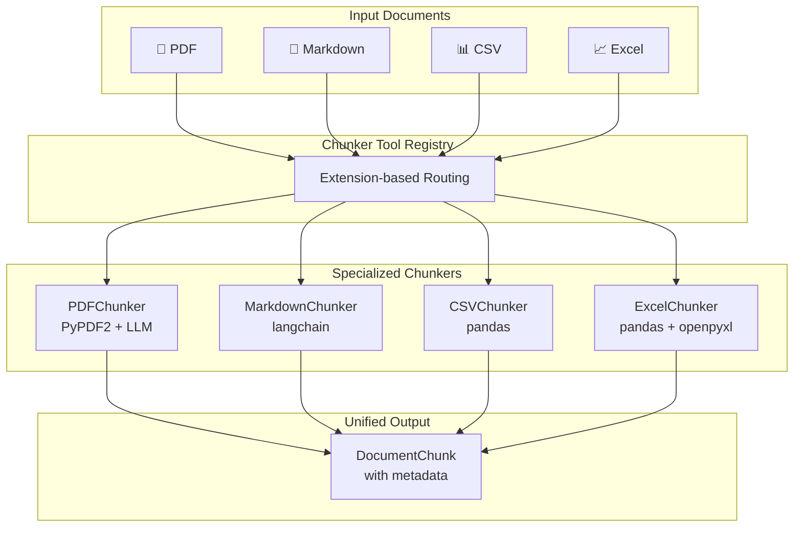

### Chunker Tool Specifications

| Tool | Input Format | Library | Chunking Strategy |
|------|--------------|---------|-------------------|
| **PDFChunker** | `.pdf` | PyPDF2 + LLM | TOC-based hierarchical splitting |
| **DocxChunker** | `.docx` | python-docx | Heading-based hierarchical splitting |
| **MarkdownChunker** | `.md` | langchain-text-splitters | Header hierarchy (H1-H4) |
| **CSVChunker** | `.csv`, `.tsv` | pandas | Row-based grouping |
| **ExcelChunker** | `.xlsx`, `.xls` | pandas + openpyxl | Sheet-aware processing |

### DocumentChunk Schema

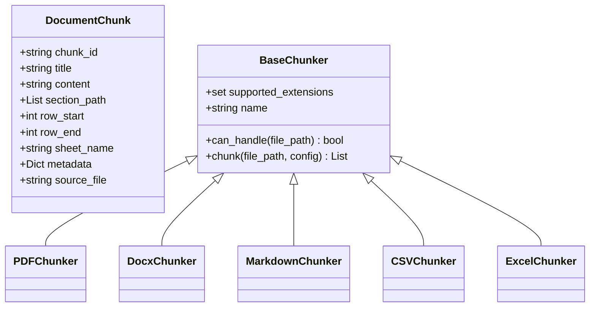

---

## 4. Prompt Architecture

The system uses production prompts loaded at runtime by `PromptManager`.

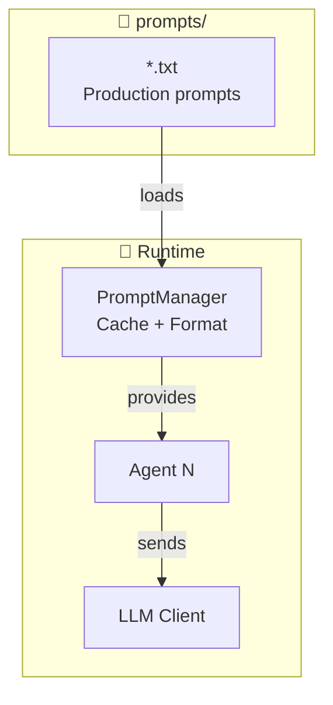

### Prompt-to-Agent Mapping

| Agent | Prompt File | Focus |
|-------|-------------|-------|
| 1 | `document_structure_analysis.txt` | TOC extraction, hierarchical chunking |
| 2 | `entity_extraction.txt`, `entity_refinement.txt` | Entity/relationship discovery |
| 3 | `business_rules_extraction.txt` | Rule extraction with taxonomy |
| 3.5 | `validation_report.txt` | Source verification |
| 5 | `rule_deduplication.txt`, `dependency_analysis.txt` | Dedup, dependency mapping |
| 8 | `rule_matcher.txt`, `rule_matcher_batch.txt` | Semantic similarity |

---

## 5. LLM Integration Architecture

### LLM Interface

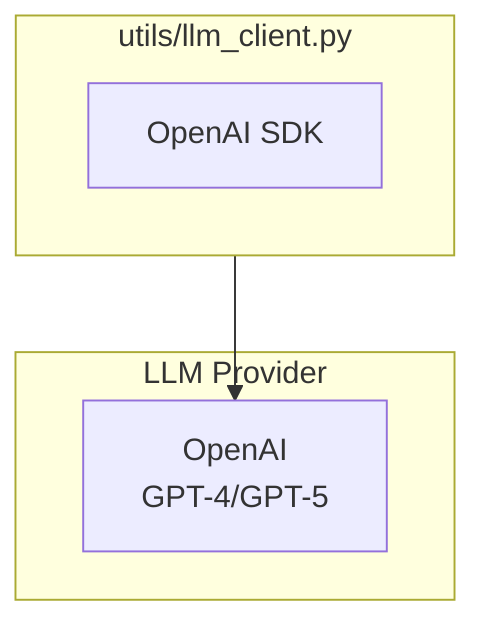

### Extraction Settings

| Aspect | Value |
|--------|-------|
| Batch Size | 10 rules/batch |
| Worker Count | 20 parallel |
| Output Path | `pipeline-output/` |

---

## 6. Data Flow Architecture

### Output Directory Structure

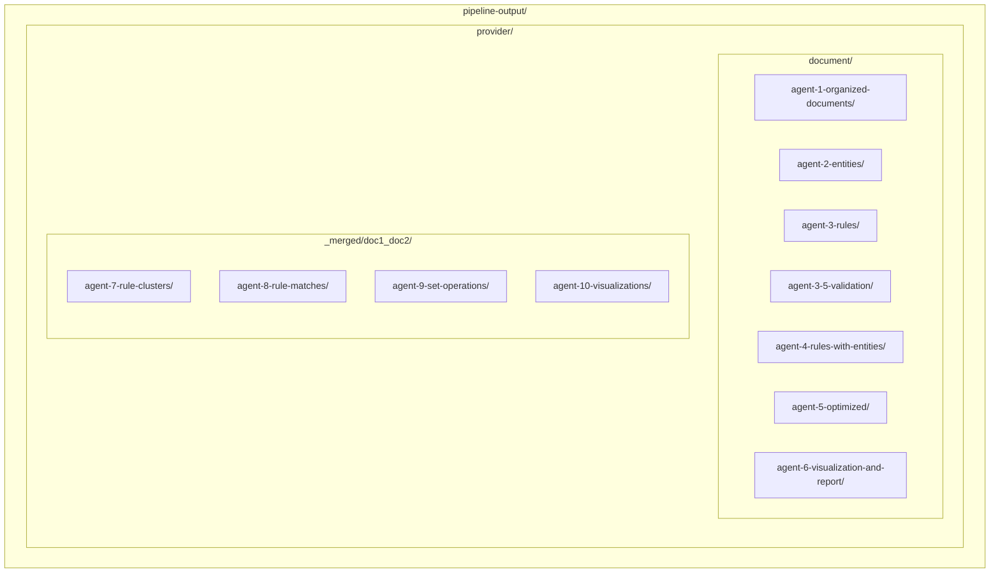

### Inter-Agent Data Contracts

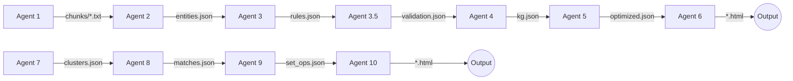

---

## 7. Deployment Architecture

### Container Architecture

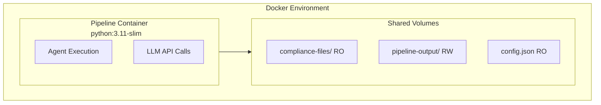

### Running with Docker

```bash
# Build and start all services
docker-compose up -d

# Run extraction pipeline
docker-compose exec pipeline python cli/extract.py --provider openai --document FM

# Run joins pipeline
docker-compose exec pipeline python cli/compare.py --g1 SAMPLE_GUIDELINES --g2 Policy-Overlay

# View reports directly
open pipeline-output/openai/SAMPLE_GUIDELINES/agent-6-visualization-and-report/SAMPLE_GUIDELINES_knowledge_graph.html
```

---

## 8. Extension Architecture

### Adding a New Agent

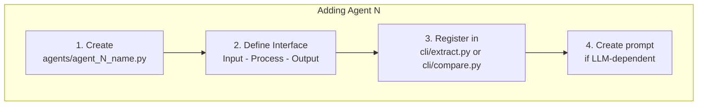

### Adding a New Rule Type

1. **Update taxonomy** in `prompts/business_rules_extraction.txt`
2. **Update visualization** color mapping in agent_6 and agent_10

---

## 9. Security Considerations

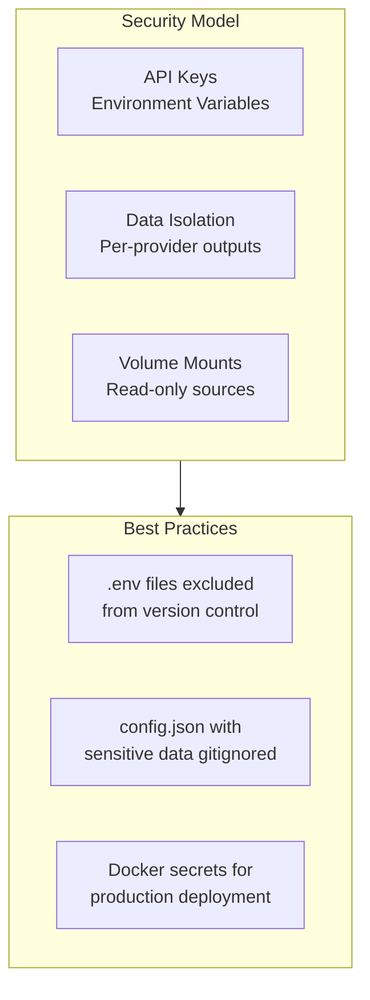

---

## Related Documentation

| Document | Purpose |
|----------|---------|
| [README.md](../README.md) | Project overview and quick start |
| [DOCKER.md](DOCKER.md) | Container deployment guide |
| [SETUP.md](SETUP.md) | Local environment setup |
| [agents/README.md](../agents/README.md) | Agent implementation details |
| [prompts/README.md](../prompts/README.md) | Production prompt reference |


---

**Version**: 4.1 | **Updated**: February 2026 | **Mermaid Diagrams**: ✅
