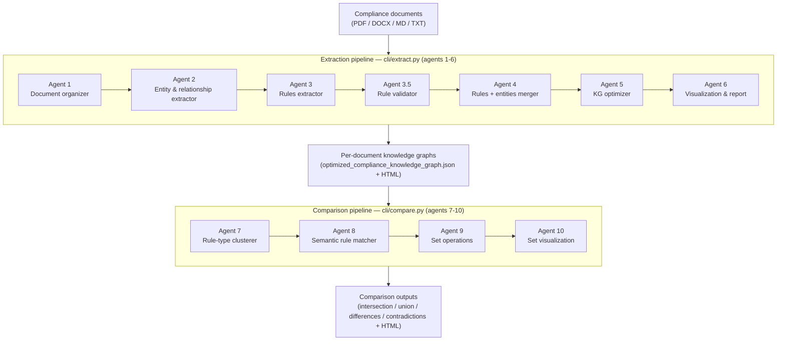

# Policy to Knowledge — Product Definition

> **Turn compliance policy documents into queryable knowledge graphs.**
> Policy to Knowledge ingests complex compliance and regulatory documents and uses a
> 10-agent OpenAI pipeline to extract entities, business rules, and dependencies,
> then renders them as structured, queryable knowledge graphs with interactive
> visualizations.

| | |
| --- | --- |
| **Document** | Technical Product Definition |
| **Status** | Living document — generated from source analysis |
| **Repository** | [github.com/rrahimi-uci/policy-to-knowledge](https://github.com/rrahimi-uci/policy-to-knowledge) |
| **License** | MIT |

---

## Table of Contents

1. [Overview](#1-overview)
2. [Problem & Motivation](#2-problem--motivation)
3. [Solution Architecture](#3-solution-architecture)
4. [The 10-Agent Pipeline](#4-the-10-agent-pipeline)
5. [Technology Stack](#5-technology-stack)
6. [Features & Capabilities](#6-features--capabilities)
7. [Use Cases](#7-use-cases)
8. [Output Artifacts](#8-output-artifacts)
9. [Running the Pipeline](#9-running-the-pipeline)
10. [Extensibility & Domain Support](#10-extensibility--domain-support)
11. [Value & ROI](#11-value--roi)
12. [Roadmap](#12-roadmap)
13. [Appendix: Glossary](#13-appendix-glossary)

---

## 1. Overview

**Policy to Knowledge** is an automated, multi-agent platform that transforms
unstructured compliance documents into structured knowledge graphs. Policy text
that normally lives in hundreds of pages of PDF becomes a machine-readable graph
of entities, typed business rules, and the dependencies between them — queryable,
visualizable, and comparable across documents.

```
Compliance documents  →  10-agent OpenAI pipeline  →  Knowledge graph + visualizations
```

- **Input** — Unstructured compliance documents: PDF, DOCX, Markdown, TXT.
- **Process** — Multi-agent extraction, validation, optimization, and comparison.
- **Output** — Structured JSON knowledge graphs with entities, typed business
  rules, dependencies, source references, and self-contained interactive HTML
  visualizations.

### 1.1 The Suite

Policy to Knowledge is a monorepo of three apps under `apps/`:

| App | Stack | Port | Role |
| --- | --- | --- | --- |
| **shell** | React suite shell | `4000` | Unified entry point for the suite |
| **pipeline** | FastAPI API + React/Vite UI + 10-agent OpenAI pipeline | API `8000`, UI `5173` | Extract and compare knowledge graphs (this document) |
| **explorer** | Flask + JanusGraph (served under the `/app` prefix) | `5000` (falls back to `5050` if `5000` is taken) | Interactive graph exploration |

This document describes the **pipeline** app — the extraction and comparison
engine at the heart of the suite.

### 1.2 At a Glance

| Aspect | Detail |
| --- | --- |
| Pipeline | 10 cooperating agents (extraction agents 1–6, comparison agents 7–10) |
| Entry points | `cli/extract.py` (agents 1–6), `cli/compare.py` (agents 7–10) |
| LLM provider | OpenAI only |
| Default models | Reasoning `gpt-5.2`, optimizer `gpt-5.2`, embeddings `text-embedding-ada-002` |
| Supported domains | mortgage, AML, healthcare, commercial lending |
| Rule taxonomy | 10 rule categories |
| Dependency types | 7 dependency relationships |
| Traceability | Every rule carries a `source_reference` (chunk path) back to the source document |

---

## 2. Problem & Motivation

### 2.1 The Compliance Knowledge Problem

Organizations in regulated industries manage large, overlapping, and frequently
changing bodies of policy. The knowledge those documents contain is difficult to
extract, easy to misinterpret, and almost impossible to compare across sources by
hand.

| Pain Point | Why It Hurts | How Policy to Knowledge Helps |
| --- | --- | --- |
| **Manual rule extraction** | Analysts spend many hours reading 500+ page documents | Automated extraction in a single pipeline run |
| **Inconsistent interpretation** | Different analysts extract rules differently, creating gaps | A 10-category rule taxonomy enforces consistency |
| **Hidden dependencies** | Critical rule dependencies are buried in prose | 7 dependency types with strength ratings make them explicit |
| **Conflicting rules** | Contradictory requirements across documents go undetected | Comparison pipeline surfaces contradictions automatically |
| **No version comparison** | Hard to see what changed between regulatory updates | Set operations: intersection, union, differences |
| **Knowledge silos** | Extracted rules sit in spreadsheets, not a queryable model | JSON knowledge graph with typed entities and relationships |

### 2.2 The Conflict Problem

One of the most consequential compliance risks is **conflicting rules** across
regulatory bodies, document versions, overlapping jurisdictions, and the boundary
between internal policy and external regulation. Without tooling, conflicts tend
to surface only through failed audits, rejected applications, fines, and disputes.

Policy to Knowledge detects conflicts proactively:

- Contradiction detection across documents.
- Semantic matching that identifies conflicting thresholds.
- Side-by-side rule comparison.

### 2.3 Target Users

| Persona | Responsibility | Where Policy to Knowledge Helps |
| --- | --- | --- |
| **Chief Compliance Officer** | Enterprise-wide compliance oversight | Unified knowledge graph with cross-document conflict detection |
| **Compliance Analyst** | Extract and document business rules | Automated extraction with confidence scoring |
| **Regulatory Affairs Manager** | Track regulatory change and impact | Version comparison with change detection |
| **Software Engineer** | Build systems that enforce compliance rules | Machine-readable JSON graph with typed rules and relationships |
| **Internal Auditor** | Verify compliance with requirements | Source references and dependency tracing |

### 2.4 Why Existing Approaches Fall Short

| Approach | Limitation | Policy to Knowledge Approach |
| --- | --- | --- |
| Manual extraction | Slow and inconsistent | AI-driven parallel batch extraction |
| Keyword search | Misses context and relationships | Semantic entity and relationship extraction |
| Simple NLP | Cannot follow complex regulatory logic | LLM reasoning with domain-specific prompts |
| Document management | Stores documents, not knowledge | Builds a queryable knowledge graph |
| Generic AI tools | Not tuned for compliance | Domain prompt packs (mortgage, AML, healthcare, commercial lending) |

---

## 3. Solution Architecture

### 3.1 Pipeline Flow

The platform runs in two phases. The **extraction** phase (agents 1–6, driven by
`cli/extract.py`) turns a single document into an optimized knowledge graph. The
**comparison** phase (agents 7–10, driven by `cli/compare.py`) compares two graphs
and computes set operations between them.



### 3.2 Value Propositions

| Value | How It Is Delivered |
| --- | --- |
| **Speed** | Parallel batch extraction with configurable workers |
| **Accuracy** | 5-factor confidence scoring plus a dedicated validation agent |
| **Consistency** | 10-category rule taxonomy and shared domain prompts |
| **Visibility** | Self-contained interactive HTML visualizations |
| **Comparability** | Comparison pipeline (`cli/compare.py`) with semantic matching |
| **Traceability** | Each rule carries a `source_reference` back to its source chunk |
| **Extensibility** | Domain prompt packs under `domain-prompts/` |

---

## 4. The 10-Agent Pipeline

### 4.1 Agent Inventory

| Agent | File | Purpose | LLM |
| --- | --- | --- | --- |
| **1** | `agents/agent_1_document_organizer.py` | Document → TOC-based hierarchical chunks | Optional |
| **2** | `agents/agent_2_entity_extractor.py` | Extract entities and relationships (meta-agent) | Yes |
| **3** | `agents/agent_3_rules_extractor.py` | Extract business rules (parallel batch) | Yes |
| **3.5** | `agents/agent_3_5_rule_validator.py` | Validate rule quality and consistency (non-blocking) | Yes |
| **4** | `agents/agent_4_rules_with_entities_merger.py` | Enrich rules with entity context | No |
| **5** | `agents/agent_5_knowledge_graph_optimizer.py` | Deduplicate rules and analyze dependencies | Yes |
| **6** | `agents/agent_6_visualization_and_report.py` | Generate interactive HTML visualization | No |
| **7** | `agents/agent_7_rule_type_clusterer.py` | Cluster rules by behavior (the *how* dimension) | No |
| **8** | `agents/agent_8_semantic_rule_matcher.py` | Pairwise semantic rule comparison | Yes |
| **9** | `agents/agent_9_set_operations.py` | Set operations: ∩, differences, ∪, contradictions | No |
| **10** | `agents/agent_10_set_visualization.py` | Generate comparison reports | No |

### 4.2 Extraction Pipeline (Agents 1–6)

Run via `cli/extract.py`. Each stage consumes the previous stage's output.

| Stage | Agent | Input → Output |
| --- | --- | --- |
| **1. Organize** | Document organizer | Document → hierarchical text chunks (`agent-1-organized-documents/`) |
| **2. Entities** | Entity extractor | Chunks → `entity_types_and_relationships.json`; an iterative meta-agent scores its own output across 5 dimensions (completeness, relationship quality, attribute coverage, clarity, consistency) and refines until it clears the configured threshold |
| **3. Rules** | Rules extractor | Chunks + entities → `compliance_rules_with_entities.json`; parallel batch extraction with the 10-category taxonomy and 5-factor confidence scoring |
| **3.5. Validate** | Rule validator | Rules → `validation_report.json`; source verification, numeric consistency, and contradiction checks. Non-blocking — the pipeline continues even when issues are flagged |
| **4. Merge** | Rules + entities merger | Rules + entities → `compliance_knowledge_graph.json`, `business_rules_complete.csv`; enriches rules with entity definitions and preserves referential integrity |
| **5. Optimize** | KG optimizer | Graph → `optimized_compliance_knowledge_graph.json`; conservative LLM-based deduplication plus 7-type dependency analysis with strength ratings |
| **6. Visualize** | Visualization & report | Optimized graph → `{source_name}_knowledge_graph.html`; self-contained interactive network graph |

### 4.3 Comparison Pipeline (Agents 7–10)

Run via `cli/compare.py` against two existing knowledge graphs.

| Stage | Agent | Input → Output |
| --- | --- | --- |
| **7. Cluster** | Rule-type clusterer | Two graphs → `rule_clusters.json`; groups rules by behavior type so comparison stays within comparable clusters |
| **8. Match** | Semantic rule matcher | Clustered rules → `match_results.json`; LLM-powered pairwise comparison classified as IDENTICAL, EQUIVALENT, SIMILAR, DIFFERENT, or CONTRADICTORY |
| **9. Set operations** | Set operations | Match results → `intersection.json`, `union.json`, `g1_minus_g2.json`, `g2_minus_g1.json`, `contradictions.json` |
| **10. Visualize** | Set visualization | Set results → `index.html` plus a report per operation |

**Set operations computed by Agent 9:**

| Operation | Definition |
| --- | --- |
| Intersection (G1 ∩ G2) | Rules present in both graphs (IDENTICAL / EQUIVALENT matches) |
| Union (G1 ∪ G2) | All unique rules across both graphs, deduplicated |
| Left difference (G1 − G2) | Rules exclusive to the first graph |
| Right difference (G2 − G1) | Rules exclusive to the second graph |
| Contradictions | Rule pairs on the same topic with conflicting requirements |

---

## 5. Technology Stack

### 5.1 Components

| Layer | Technology | Purpose |
| --- | --- | --- |
| Language | Python 3.11 | Pipeline implementation |
| LLM interface | OpenAI Python SDK | Chat completions and embeddings |
| Models | OpenAI GPT-5.2 (default) | Reasoning, extraction, optimization |
| Document processing | PyPDF2, langchain-text-splitters, python-docx, pandas | Chunking PDF / DOCX / CSV / Excel |
| OCR (scanned PDFs) | pytesseract, pdf2image, Pillow | Text recovery from image-only PDFs |
| Visualization | vis.js (embedded in generated HTML) | Interactive network graphs |
| API / UI | FastAPI, React/Vite | Backend API and web UI |
| Packaging | Docker, Docker Compose | Containerized deployment |

### 5.2 Model Configuration

Models are defined in `config.json` and can be changed from the Settings UI.

```json
{
  "openai": {
    "models": {
      "reasoning": "gpt-5.2",
      "reasoning_effort": "high",
      "optimizer": "gpt-5.2",
      "embeddings": "text-embedding-ada-002"
    }
  }
}
```

### 5.3 Pipeline Configuration

Tunable parameters also live in `config.json`:

```json
{
  "pipeline": {
    "max_workers": 30,
    "supported_extensions": [".pdf", ".txt", ".md", ".docx"]
  },
  "rules_extractor": {
    "target_rules": 300,
    "rules_per_batch": 10
  },
  "entity_extractor": {
    "n_iterations": 3,
    "min_score_threshold": 70
  },
  "document_organizer": {
    "chunk_size_target": 2000,
    "max_chunk_size": 3000,
    "min_chunk_size": 500,
    "chunk_overlap": 200
  }
}
```

### 5.4 Requirements

| Component | Minimum | Recommended |
| --- | --- | --- |
| Python | 3.10 | 3.11 |
| RAM | 8 GB | 16 GB |
| Docker | 20.10+ | 24.0+ |
| OpenAI access | `OPENAI_API_KEY` | Higher rate-limit tier for large documents |

Core dependencies (`requirements.txt`):

```text
openai>=1.59.7                   # OpenAI Python SDK
python-dotenv>=1.0.0             # Load .env
PyPDF2>=3.0.1                    # PDF processing
pytesseract>=0.3.10              # OCR for scanned PDFs
pdf2image>=1.17.0                # PDF pages → images for OCR
langchain-text-splitters>=0.2.0  # Markdown/text splitting
pandas>=2.0.0                    # CSV/Excel processing
python-docx>=1.1.0               # Word document support
```

---

## 6. Features & Capabilities

### 6.1 Rule Taxonomy (10 Categories)

Defined in `prompts/business_rules_extraction.txt`.

| Category | Description | Example |
| --- | --- | --- |
| **eligibility** | Who or what qualifies | "Borrower must have credit score ≥ 620" |
| **constraint** | Limits and restrictions | "Maximum LTV 97% for first-time buyers" |
| **calculation** | Formulas and computations | "LTV = loan amount / appraised value" |
| **validation** | Verification requirements | "Verify employment within 120 days" |
| **process** | Procedural steps | "Submit application via the portal" |
| **compliance** | Regulatory adherence | "Comply with applicable disclosure rules" |
| **documentation** | Required documents | "Provide last 2 years of tax returns" |
| **prohibition** | Explicitly forbidden | "Interest-only loans prohibited for QM" |
| **definition** | Term definitions | "Primary residence means borrower-occupied" |
| **exception** | Special cases | "Except when compensating factors exist" |

### 6.2 Dependency Analysis (7 Types)

Defined in `prompts/dependency_analysis.txt`. Each dependency is rated for
strength (1–5).

| Type | Description | Example |
| --- | --- | --- |
| **prerequisite** | Must complete before the dependent rule | "Credit report obtained before score validation" |
| **sequential** | Natural ordering of rules | "Appraisal before underwriting decision" |
| **conditional** | Applies only under a condition | "If DTI > 43%, compensating factors required" |
| **complementary** | Rules that work together | "LTV and CLTV calculated together" |
| **contradictory** | Potential conflict | "Max LTV 97% vs. max LTV 95% for condos" |
| **override** | Supersedes another rule | "Manual underwrite overrides automated findings" |
| **validation** | Validates an outcome | "QC review validates the underwriting decision" |

### 6.3 Confidence Scoring (5 Factors)

Each extracted rule receives a confidence score (0–100), weighted equally across
five factors.

| Factor | Weight | Criterion |
| --- | --- | --- |
| Source specificity | 20% | Clear reference to a document section |
| Metric clarity | 20% | Quantifiable thresholds present |
| Condition completeness | 20% | All conditions explicitly stated |
| Example quality | 20% | Concrete examples provided |
| Consequence clarity | 20% | Clear outcomes defined |

### 6.4 Semantic Rule Matching

Agent 8 classifies each candidate rule pair into a match type:

| Match Type | Meaning |
| --- | --- |
| **IDENTICAL** | Same rule, same thresholds |
| **EQUIVALENT** | Same practical effect, different wording |
| **SIMILAR** | Related but distinct requirements |
| **DIFFERENT** | No meaningful relationship |
| **CONTRADICTORY** | Same topic, conflicting requirements |

---

## 7. Use Cases

### 7.1 Single-Document Extraction (Mortgage)

Extract a structured knowledge graph from a mortgage selling guide.

```bash
python cli/extract.py --source-file compliance-files/selling-guide.pdf --provider openai
```

Output layout:

```text
pipeline-output/openai/selling-guide/
├── agent-1-organized-documents/        # hierarchical text chunks
├── agent-2-entities/
│   └── entity_types_and_relationships.json
├── agent-3-rules/
│   └── compliance_rules_with_entities.json
├── agent-5-optimized/
│   └── optimized_compliance_knowledge_graph.json
└── agent-6-visualization-and-report/
    └── selling-guide_knowledge_graph.html
```

A representative extracted rule:

```json
{
  "rule_id": "BR_BORROWER_042",
  "rule_type": "constraint",
  "description": "Maximum debt-to-income ratio for qualified mortgages",
  "conditions": ["Loan type = Qualified Mortgage (QM)", "No manual underwrite"],
  "threshold": "DTI <= 43%",
  "consequences": ["Loan may not qualify for QM safe harbor if exceeded"],
  "exceptions": ["With compensating factors, DTI up to 50% permitted"],
  "source_reference": "B3-6-02, Part B.1.3",
  "confidence_score": 92,
  "entities_referenced": ["BORROWER", "LOAN", "DTI_RATIO", "QUALIFIED_MORTGAGE"]
}
```

The `source_reference` field links each rule back to the document chunk it came
from, providing document-to-graph traceability.

### 7.2 Regulatory Update Impact Analysis

Process a new version of a document, then compare it against the previous version
to see what changed.

```bash
# Extract the new version
python cli/extract.py --source-file compliance-files/selling-guide-2026-q1.pdf --provider openai

# Compare against the previous version
python cli/compare.py --g1 selling-guide --g2 selling-guide-2026-q1 --workers 15
```

The comparison output identifies rules that are unchanged, modified, added, or
removed, along with any contradictions introduced by the new version.

### 7.3 Cross-Document Conflict Resolution

Compare a base guideline graph against an overlay (additional requirements layered
on top of the base regulation).

```bash
python cli/compare.py --g1 selling-guide --g2 policy-overlay --workers 15
```

Output layout:

```text
pipeline-output/_merged/selling-guide_policy-overlay/
├── agent-7-rule-clusters/
│   └── rule_clusters.json
├── agent-8-rule-matches/
│   └── match_results.json
├── agent-9-set-operations/
│   ├── intersection.json     # rules in both graphs
│   ├── g1_minus_g2.json      # rules only in the base
│   ├── g2_minus_g1.json      # rules only in the overlay
│   ├── union.json            # all unique rules
│   └── contradictions.json   # conflicting pairs
└── agent-10-visualizations/
    ├── index.html            # summary dashboard
    ├── intersection.html
    ├── union.html
    └── contradictions.html
```

The contradictions report makes threshold conflicts explicit — for example, a base
guideline allowing a maximum LTV of 85% for investment property versus an overlay
restricting it to 75% — so they can be reconciled before they reach production.

---

## 8. Output Artifacts

### 8.1 Primary Outputs

| Artifact | Format | Description | Use |
| --- | --- | --- | --- |
| `optimized_compliance_knowledge_graph.json` | JSON | Final per-document knowledge graph | Integration with rule engines |
| `business_rules_complete.csv` | CSV | All rules in spreadsheet form | Manual review |
| `{source_name}_knowledge_graph.html` | HTML | Self-contained interactive visualization | Stakeholder review |
| `validation_report.json` | JSON | Quality metrics from Agent 3.5 | Quality assurance |
| `intersection.json` / `union.json` / `g1_minus_g2.json` / `g2_minus_g1.json` / `contradictions.json` | JSON | Comparison set operations | Cross-document analysis |

### 8.2 Knowledge Graph Schema

```json
{
  "metadata": {
    "document_name": "selling-guide",
    "extraction_date": "2026-01-23",
    "total_rules": 244,
    "total_entities": 44,
    "total_dependencies": 18
  },
  "entities": [
    {
      "entity_type": "BORROWER",
      "attributes": ["credit_score", "income", "employment_status"],
      "definition": "Individual applying for a mortgage loan",
      "examples": ["Primary borrower", "Co-borrower"]
    }
  ],
  "business_rules": [
    {
      "rule_id": "BR_BORROWER_042",
      "rule_type": "constraint",
      "description": "Maximum DTI ratio for QM loans",
      "conditions": ["Loan type = QM"],
      "threshold": "DTI <= 43%",
      "confidence_score": 92,
      "source_reference": "B3-6-02, Part B.1.3",
      "entities_referenced": ["BORROWER", "LOAN"],
      "dependencies": [
        {
          "depends_on_rule": "BR_INCOME_015",
          "dependency_type": "prerequisite",
          "strength": 4,
          "rationale": "Income must be calculated before DTI"
        }
      ]
    }
  ],
  "relationships": [
    {
      "from_entity": "BORROWER",
      "to_entity": "LOAN",
      "relationship_type": "APPLIES_FOR",
      "cardinality": "one-to-many"
    }
  ]
}
```

### 8.3 Directory Structure

```text
pipeline-output/
└── openai/                              # provider
    ├── <document-1>/
    │   ├── agent-1-organized-documents/
    │   ├── agent-2-entities/
    │   ├── agent-3-rules/
    │   ├── agent-3-5-validation/
    │   ├── agent-4-rules-with-entities/
    │   ├── agent-5-optimized/
    │   └── agent-6-visualization-and-report/
    ├── <document-2>/
    │   └── ...                          # same structure
    └── _merged/                         # comparison outputs (agents 7-10)
        └── <document-1>_<document-2>/
            ├── agent-7-rule-clusters/
            ├── agent-8-rule-matches/
            ├── agent-9-set-operations/
            └── agent-10-visualizations/
```

---

## 9. Running the Pipeline

### 9.1 Configuration

Set the OpenAI API key in a `.env` file:

```bash
OPENAI_API_KEY=sk-...
```

Models and pipeline parameters are read from `config.json` and can be changed from
the Settings UI (see [Section 5](#5-technology-stack)).

### 9.2 Local CLI

```bash
# 1. Set up the environment
python3 -m venv .venv
.venv/bin/pip install -r requirements.txt

# 2. Add a source document
cp your-document.pdf compliance-files/

# 3. Run the extraction pipeline (agents 1-6)
python cli/extract.py --source-file compliance-files/your-document.pdf --provider openai

# 4. Compare two graphs (agents 7-10)
python cli/compare.py --g1 graph-a --g2 graph-b --workers 15

# 5. Open the visualization
open pipeline-output/openai/*/agent-6-visualization-and-report/*_knowledge_graph.html
```

`cli/compare.py --list` prints the knowledge graphs available for comparison.

### 9.3 Docker

The pipeline ships with a Docker Compose configuration. The `p2k` service runs the
CLI; the `p2k-ui` service runs the FastAPI API (port `8000`).

```bash
# Configure
cp .env.example .env        # edit with your OPENAI_API_KEY

# Build and run the extraction pipeline
docker-compose build
docker-compose run p2k --provider openai

# Or start the API service
docker-compose up p2k-ui
```

Generated artifacts persist to the mounted `pipeline-output/` directory. The
visualizations are self-contained HTML files and can be opened directly in a
browser, or explored interactively through the **explorer** app.

---

## 10. Extensibility & Domain Support

Policy to Knowledge ships with domain prompt packs under `domain-prompts/`:

| Domain | Directory |
| --- | --- |
| Mortgage | `domain-prompts/mortgage/` |
| Anti-money laundering (AML) | `domain-prompts/aml/` |
| Healthcare | `domain-prompts/healthcare/` |
| Commercial lending | `domain-prompts/commercial_lending/` |

Each pack overrides the base prompts in `prompts/` so the same agent pipeline can
adapt its extraction taxonomy, entity model, and dependency reasoning to a new
domain. Adding a domain is a matter of supplying a new prompt pack — no code
changes are required.

This repository ships **no proprietary data**. Source documents are user-supplied
and placed in the gitignored `compliance-files/` directory.

---

## 11. Value & ROI

Policy to Knowledge shifts compliance work from manual, error-prone document
reading toward automated extraction and analysis. The value comes from four
reinforcing effects:

| Value Driver | Effect |
| --- | --- |
| **Time savings** | A pipeline run replaces hours of manual rule extraction per document |
| **Conflict detection** | Contradictions across documents are found automatically rather than during audits |
| **Consistency** | A shared taxonomy removes analyst-to-analyst variance |
| **Analyst leverage** | Analysts move from low-value extraction to higher-value review and analysis |

> The illustrative figures and customer scenarios in earlier drafts of this
> document have been removed. Concrete savings depend on document volume, domain,
> and team size, and should be measured against each organization's own baseline.

---

## 12. Roadmap

### 12.1 Direction

| Theme | Description |
| --- | --- |
| Graph database integration | Deeper integration with the **explorer** app's JanusGraph backend |
| Incremental updates | Re-extract only the parts of a document that changed |
| Programmatic access | Expanded API surface for embedding extraction in other systems |
| Domain expansion | Additional prompt packs beyond the current four domains |
| Conflict resolution | Suggested reconciliations for detected contradictions |

### 12.2 Integration Opportunities

- **Graph exploration** — JanusGraph via the explorer app.
- **Rule engines** — export typed rules to downstream decision systems.
- **Document management** — ingest from existing document repositories.

---

## 13. Appendix: Glossary

| Term | Definition |
| --- | --- |
| **Knowledge graph** | Structured representation of entities, relationships, and rules |
| **Entity** | A domain concept (e.g., `BORROWER`, `LOAN`, `PROPERTY`) |
| **Business rule** | An extractable compliance requirement with conditions and consequences |
| **Dependency** | A typed relationship between rules (prerequisite, sequential, etc.) |
| **Meta-agent** | A self-improving agent that scores and refines its own output across iterations |
| **Source reference** | The `source_reference` field linking a rule back to its source document chunk |
| **Conflict / contradiction** | Rules from different sources with incompatible requirements |
| **Overlay** | Additional requirements layered on top of a base regulation |
| **Set operations** | Intersection, union, and difference computed over two rule sets |

---

### Related Documentation

- Architecture — [docs/ARCHITECTURE.md](ARCHITECTURE.md)
- Setup — [docs/SETUP.md](SETUP.md)
- Docker — [docs/DOCKER.md](DOCKER.md)
- Agents — [agents/README.md](../agents/README.md)
- Prompts — [prompts/README.md](../prompts/README.md)

---

*Policy to Knowledge — turning compliance documents into queryable knowledge graphs.*
*Licensed under MIT. Generated from project source analysis.*
