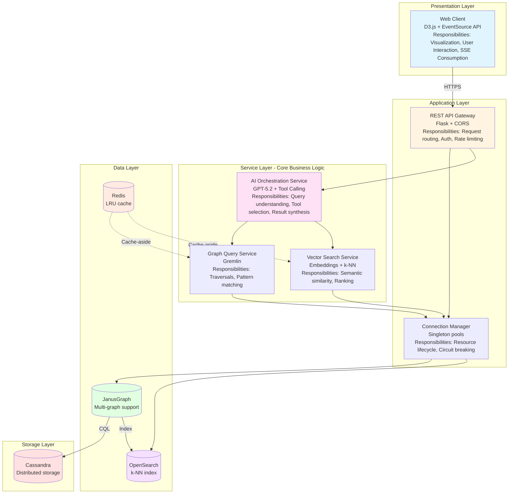
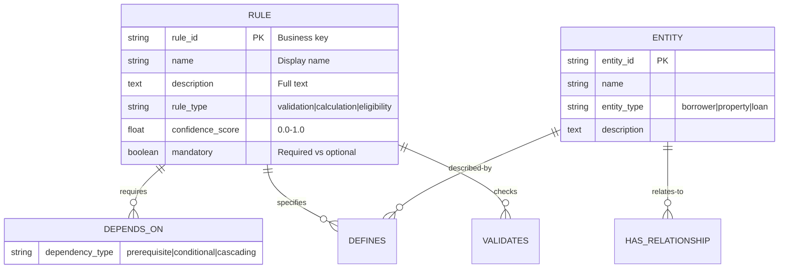
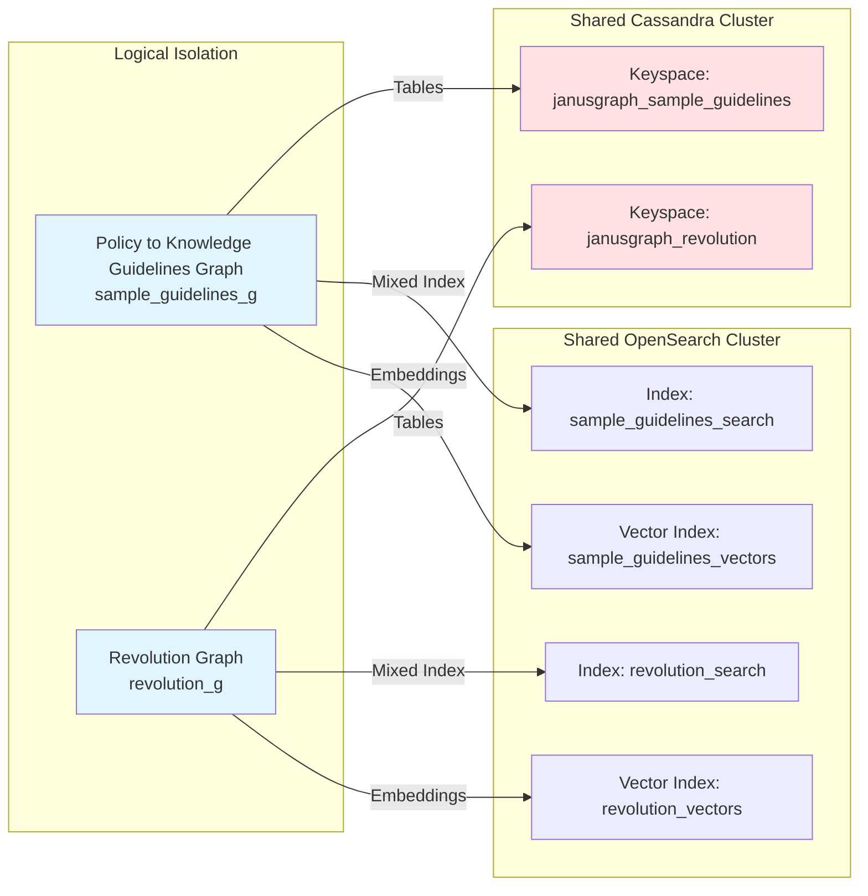
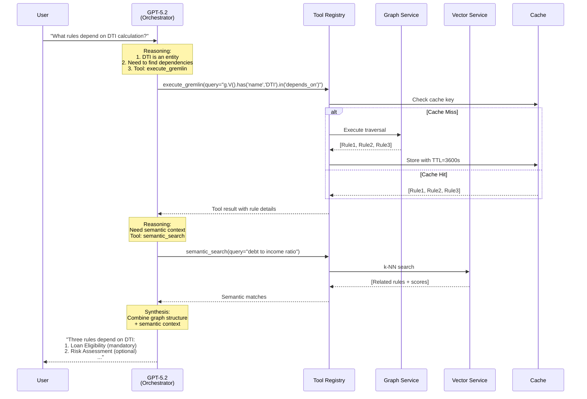
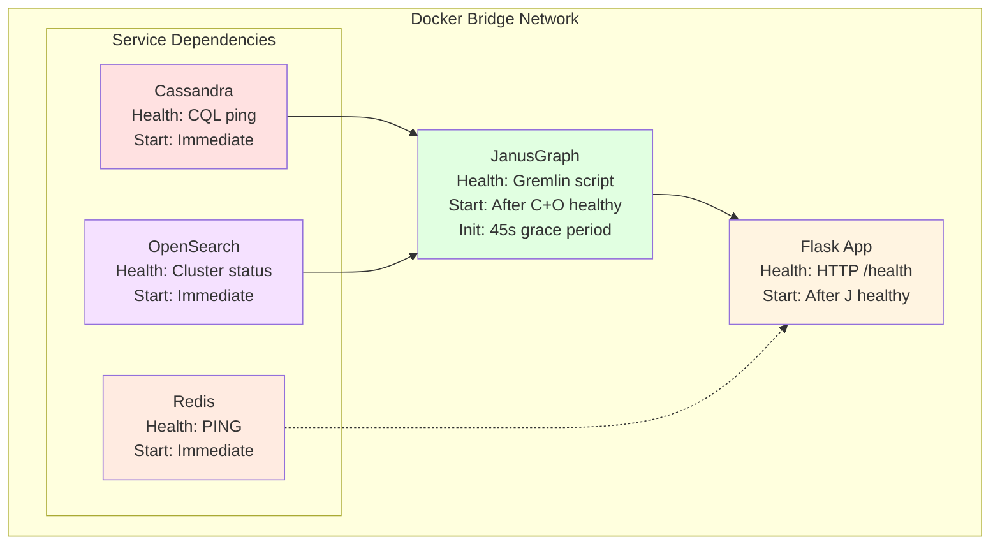

# Policy to Knowledge - System Architecture

## Executive Summary

Policy to Knowledge is a hybrid AI-graph platform designed to enable intelligent exploration of regulatory compliance knowledge through conversational interfaces, semantic search, and interactive visualization. The architecture addresses the unique challenge of navigating highly interconnected compliance rules where relationships are as critical as the rules themselves.

**Core Architectural Approach**: Graph-native data modeling with AI-augmented querying and presentation layers.

**Backend Note**: This document describes the JanusGraph/Cassandra/OpenSearch
architecture in `assistant`, which serves the shared frontend via the
`apiBaseUrl` setting.

## Table of Contents

- [Architectural Overview](#architectural-overview)
- [System Architecture](#system-architecture)
- [Data Architecture](#data-architecture)
- [Integration Architecture](#integration-architecture)
- [Deployment Architecture](#deployment-architecture)
- [Trade-offs & Constraints](#trade-offs--constraints)

---

## Architectural Overview

### Business Problem

Financial compliance requires navigating complex, interconnected rule sets where:

- Rules reference and depend on other rules (transitive dependencies)
- Relationships between rules are first-class domain concepts
- Natural language queries must resolve to precise compliance requirements
- Semantic similarity is as important as exact text matching
- Rule interpretation requires understanding multi-hop relationships

### Architectural Solution

A polyglot persistence architecture combining:

1. **Property graph database** (JanusGraph) for relationship-first modeling
2. **Vector search engine** (OpenSearch k-NN) for semantic similarity
3. **LLM orchestration layer** (GPT-5.2) for natural language understanding and reasoning
4. **Distributed caching** (Redis) for query result optimization
5. **Event-driven streaming** (SSE) for real-time user feedback


---

## System Architecture

### Logical Architecture - Layered + Service-Oriented



**Key Architectural Characteristics**:

1. **Stateless Application Layer**: All state externalized to data stores, enabling horizontal scaling
2. **Polyglot Persistence**: Specialized data stores per workload (graph, search, cache)
3. **Connection Pooling**: Singleton pools with circuit breakers prevent connection exhaustion
4. **Cache-Aside Pattern**: Application manages cache, data layer unaware of caching
5. **Event-Driven UI**: Server-Sent Events eliminate polling and reduce server load

---

### Technology Stack Rationale

| Category | Technology | Key Decision Factors |
| -------- | ---------- | -------------------- |
| **Graph Database** | JanusGraph 1.0 | TinkerPop compliance, polyglot backends, Apache license |
| **Storage Backend** | Cassandra 4.1 | Linear scalability, tunable consistency, proven at scale |
| **Search & Vectors** | OpenSearch 2.17 | Open source, k-NN plugin, JanusGraph integration |
| **Application Runtime** | Python 3.10 + Flask 3.1.2 | Rich ML ecosystem, rapid development, OpenAI SDK |
| **LLM** | GPT-5.2 | Strong reasoning, native tool calling, streaming support |
| **Embedding Model** | all-MiniLM-L6-v2 (384-dim) | Balance of speed (50ms) and quality (0.92 NDCG@10) |
| **Cache** | Redis 7 | Sub-millisecond latency, LRU eviction, production-hardened |
| **Orchestration** | Docker Compose v2 | Development simplicity, production path to Kubernetes |

---

## Data Architecture

### Graph Schema - Domain Model

The schema models compliance as a directed property graph optimized for relationship traversal:



**Schema Design Principles**:

1. **Edges as First-Class Entities**: Dependency types are edge properties, enabling queries like "find all prerequisite dependencies"
2. **Denormalization for Read Performance**: Rule descriptions stored in vertex (duplication acceptable for query speed)
3. **Weak Schema**: No foreign key constraints—graph relationships enforce referential integrity
4. **Immutable IDs**: Business keys (rule_id) separate from internal JanusGraph IDs for stability

**Index Strategy**:

| Index Type | Fields | Purpose | Backend | Performance Impact |
| ---------- | ------ | ------- | ------- | ------------------ |
| **Mixed** | name, description (text) | Full-text search | OpenSearch | Write: +50ms, Read: <100ms |
| **Composite** | rule_id (unique) | Fast PK lookup | Cassandra | Write: +5ms, Read: <10ms |
| **k-NN Vector** | embedding (384-dim float[]) | Semantic similarity | OpenSearch | Write: +100ms, Read: <150ms |

**Trade-off Analysis**:

- Mixed indexing adds write latency but enables complex text queries without graph scans
- Separate k-NN index (not in JanusGraph) simplifies embedding model updates
- No edge indexes—relationship traversal is O(1) in graph databases

---

### Multi-Graph Isolation



**Graph Manifest** (`conf/graphs.yaml`):

| Graph | Traversal Source | Cassandra Keyspace | OpenSearch Index | KG File |
| ----- | ---------------- | ------------------ | ---------------- | ------- |
| Policy to Knowledge Guidelines | `sample_guidelines_g` | `janusgraph_sample_guidelines` | `sample_guidelines_search` | `kgs/sample-guidelines-kg.json` |
| Revolution | `revolution_g` | `janusgraph_revolution` | `revolution_search` | `kgs/revolution-kg.json` |

New graphs are added by appending an entry to `graphs.yaml` and running `python scripts/generate_graph_config.py`, which auto-generates JanusGraph properties files, `gremlin-server.yaml`, and `init-graphs.groovy`.

**Isolation Benefits**:

- **Failure isolation**: Index corruption in one graph doesn't affect others
- **Performance isolation**: Heavy queries bounded to single keyspace
- **Schema evolution**: Independent schema versioning per graph
- **Compliance**: Regulatory data segregation without application-level filtering
- **Extensibility**: Add new graphs via `graphs.yaml` without code changes

**Shared Infrastructure Efficiency**:

- Single Cassandra cluster reduces operational overhead
- Replication factor (RF=3) applied per keyspace
- OpenSearch shared but logically isolated via index namespaces

---

## Integration Architecture

### AI-Graph Integration Pattern

**Challenge**: LLMs operate on text; graphs operate on structured relationships. Bridging requires:

1. Converting natural language to graph queries (intent → traversal)
2. Enriching graph results with semantic context
3. Synthesizing graph data into natural language responses

**Solution**: Tool-calling orchestration as an integration layer



**Integration Patterns Employed**:

1. **Adapter Pattern**: Tools adapt LLM function calls to backend APIs (Gremlin, OpenSearch)
2. **Circuit Breaker**: Connection pools fail fast on backend unavailability
3. **Cache-Aside**: LLM queries cached before hitting expensive backends
4. **Correlation ID**: Trace IDs propagated through LLM → Tools → Backends for observability

**Error Handling Strategy**:

- Tool execution failures return error objects (not exceptions)
- LLM receives structured error info and can retry with different tools
- Graceful degradation: If graph unavailable, fall back to semantic search only

---

### Event-Driven Streaming - Server-Sent Events

**Context**: LLM responses can take 5-10s. Traditional request-response creates poor UX.

**Decision**: Server-Sent Events (SSE) over WebSockets.

**Rationale**:

- **Unidirectional**: Server → Client only (sufficient for our use case)
- **HTTP-based**: Works through corporate proxies, load balancers
- **Automatic reconnection**: Browser handles connection failures
- **Simpler**: No WebSocket handshake complexity

**SSE Message Protocol**:

```javascript
event: step
data: {"label": "Analyzing query", "status": "active"}

event: search
data: {"tool": "semantic_search", "nodes": [...]}

event: token
data: {"content": "Based"}

event: token
data: {"content": " on"}

event: done
data: {}
```

**Architecture Decision**:

- Single HTTP connection per chat session
- Connection held open during LLM streaming
- Progressive rendering on client (tokens → words → sentences)
- No message queuing—real-time or nothing (acceptable for chat UX)

---

## Deployment Architecture

### Containerized Services - Docker Compose



**Startup Orchestration**:

1. **Phase 1 (parallel)**: Cassandra, OpenSearch, Redis start simultaneously
2. **Phase 2 (sequential)**: JanusGraph waits for Cassandra+OpenSearch health checks
3. **Phase 3 (sequential)**: Flask waits for JanusGraph connectivity

**Health Check Design**:

- **Liveness**: Process running? (Docker HEALTHCHECK)
- **Readiness**: Service accepting requests? (Application /health endpoint)
- **Startup**: Initial grace period before first check (e.g., JanusGraph: 45s)

**Volume Strategy**:

```yaml
volumes:
  cassandra-data:   # Persistent: Graph data
  opensearch-data:  # Persistent: Indexes
  redis-data:       # Ephemeral acceptable: Cache can rebuild
```

**Resource Limits** (development):

```yaml
Cassandra:  mem_limit: 1GB,  cpus: 1.0
OpenSearch: mem_limit: 1GB,  cpus: 1.0
Redis:      mem_limit: 256MB, cpus: 0.5
JanusGraph: mem_limit: 1GB,  cpus: 1.0
Flask:      mem_limit: 512MB, cpus: 0.5
```


---

## Trade-offs & Constraints

### Key Trade-offs Made

| Decision | Advantages | Disadvantages | Context |
| -------- | ---------- | ------------- | ------- |
| **JanusGraph over Neo4j** | ✅ Apache license (free)<br/>✅ Polyglot backends<br/>✅ TinkerPop standard | ❌ Smaller community<br/>❌ Fewer managed services<br/>❌ More operational complexity | Neo4j's licensing costs prohibitive for multi-tenant SaaS |
| **GPT-5.2 vs self-hosted LLM** | ✅ Strong quality<br/>✅ Zero infra management<br/>✅ Native tool calling | ❌ API cost<br/>❌ API dependency<br/>❌ Privacy concerns | Quality gap outweighs cost for compliance domain |
| **SSE vs WebSockets** | ✅ Simpler protocol<br/>✅ HTTP-based (proxy-friendly)<br/>✅ Auto-reconnect | ❌ Unidirectional only<br/>❌ No binary support | Chat UX only needs server → client streaming |
| **Cache-aside vs write-through** | ✅ Simple logic<br/>✅ Failure isolation<br/>✅ Read-optimized | ❌ Cache invalidation complexity<br/>❌ Stale reads possible | Compliance rules change infrequently (acceptable staleness) |
| **Multi-graph vs multi-tenancy** | ✅ Complete isolation<br/>✅ Independent scaling<br/>✅ Schema independence<br/>✅ Config-driven via `graphs.yaml` | ❌ Operational overhead<br/>❌ Code complexity (routing) | Regulatory requirements may mandate isolation |

### Technical Constraints

**Hard Constraints**:

- OpenAI API rate limit: 10,000 requests/minute (GPT-5.2)
- JanusGraph single-instance limit: ~1,000 qps
- Embedding model size: 384 dimensions (fixed by all-MiniLM-L6-v2)
- Gremlin query timeout: 30 seconds (server-side)
- SSE connection limit: Typically 6 per browser per domain

**Soft Constraints** (configurable):

- Cache TTL: 1 hour (tunable based on rule change frequency)
- Connection pool size: 2-10 (tunable based on backend capacity)
- Batch size: 50 vertices (tunable based on memory)
- k-NN top-k: 10 results (tunable based on UX needs)

---

## Appendix: Key Patterns

### Design Patterns Applied

1. **Singleton (Connection Pools)**: Single connection pool instance per data store
2. **Context Manager (Resource Lifecycle)**: Automatic resource cleanup with exception safety
3. **Decorator (Cross-Cutting Concerns)**: Caching, logging, metrics added via decorators
4. **Factory (Graph Selection)**: Runtime selection of graph instance based on tenant/request
5. **Repository (Data Access)**: Abstract data access logic from business logic
6. **Observer (Event Streaming)**: SSE for real-time updates to clients
7. **Strategy (Search Algorithms)**: Pluggable search implementations (Gremlin, semantic, full-text)
8. **Circuit Breaker (Fault Tolerance)**: Fail fast on backend unavailability

### Integration Patterns

1. **Adapter**: LLM tool calls adapted to backend-specific APIs
2. **Cache-Aside**: Application manages cache lifecycle
3. **Aggregator**: LLM aggregates results from multiple tools
4. **Scatter-Gather**: Parallel tool execution with result merging
